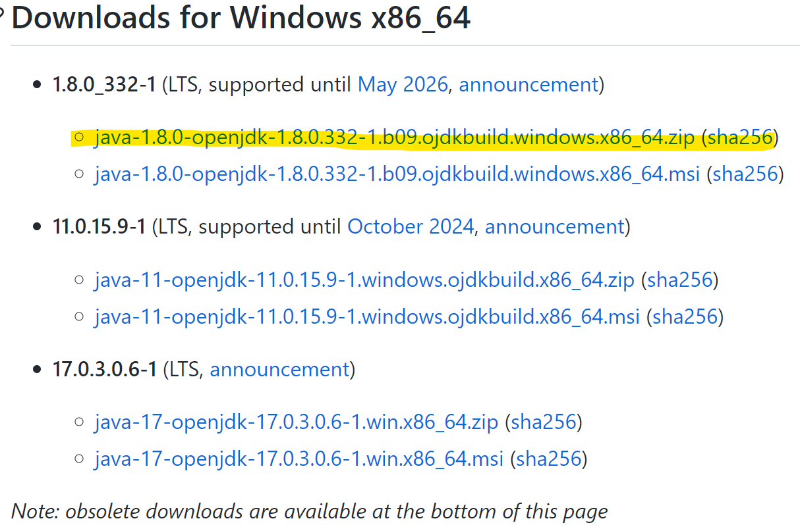
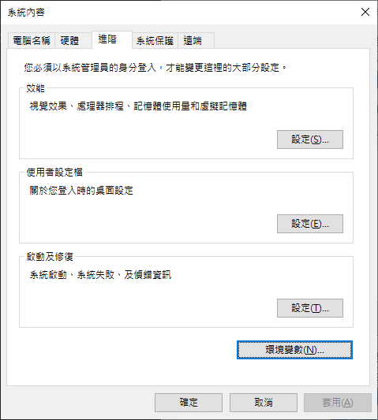
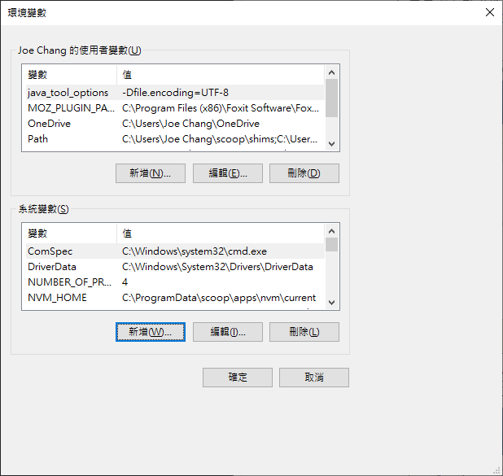
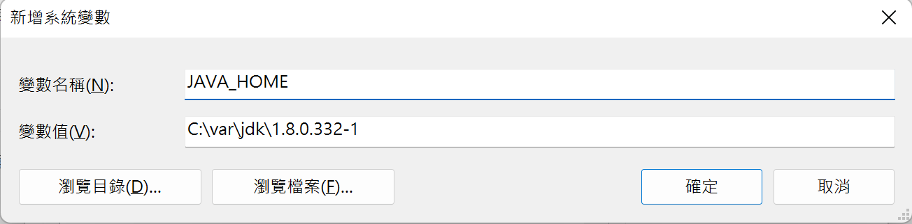
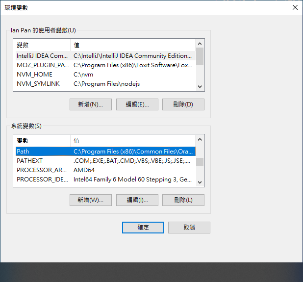
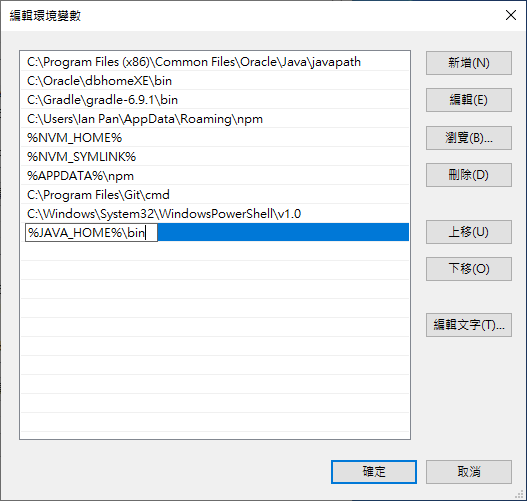
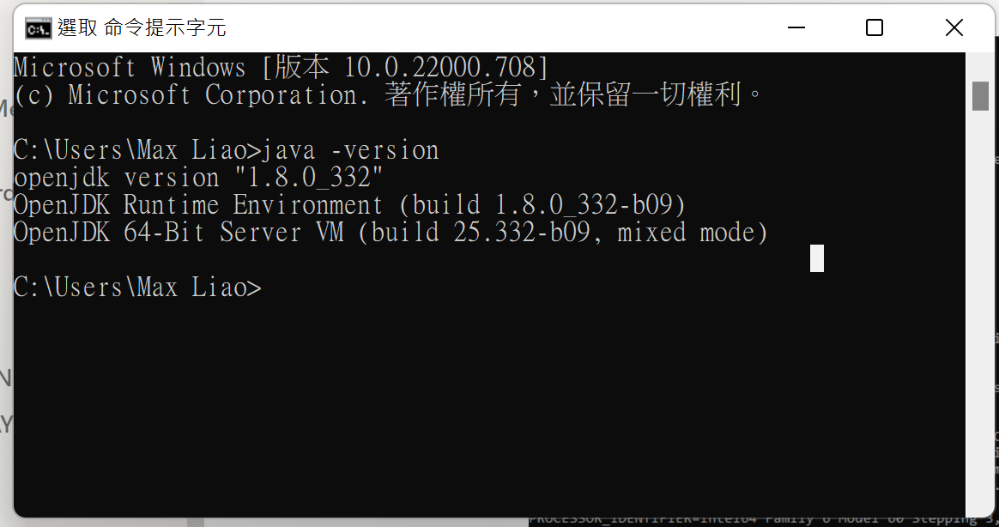
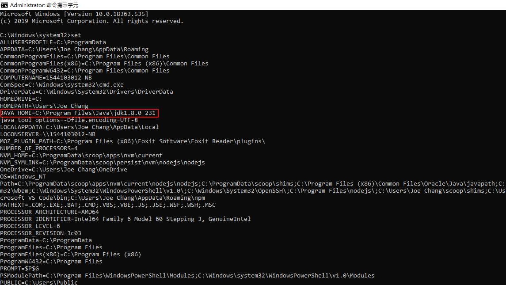

# JDK 1.8

> 範例使用 Windows 11 x64 平台, 安裝 openjdk
> 
1. 至open jdk github下載 JDK 1.8 [https://github.com/ojdkbuild/ojdkbuild](https://github.com/ojdkbuild/ojdkbuild)
2. 為了往後不同專案若有同 JDK 版本, 選擇 x86_64.zip
    
    
    
3. 解壓縮檔案到你指定的目錄路徑
    
    
    
4. 設置系統環境變數 JAVA_HOME，進入 windows 設定搜尋： 系統環境
    
    
    
5. 點選 "環境變數"
    
    
    
6. 點選 "系統變數" 的 "新增"
    
    
    
7. 設定 變數名稱： JAVA_HOME， 變數值： 剛才解壓縮的 JDK 資料夾路徑
    
    
    
8. 找到 "系統變數" 中的 "Path" 並點選 "編輯"
    
    
    
9. 點選 "新增" 並且貼上 "%JAVA_HOME%\bin"
    
    
    
10. JDK 安裝完成，測試：開起 cmd 後輸入
    
    ```bash
    $ java -version
    ```
    
    
    
11. 確認 JAVA_HOME 設定無誤，開啟 cmd 輸入
    
    ```bash
    $ set
    ```
    
    
