# IDE IntelliJ CE

> 請安裝當前最新版本
> 
1. 點擊下載 IntelliJ Community 2021.3
- [https://www.jetbrains.com/idea/download/download-thanks.html?platform=windows&code=IIC](https://www.jetbrains.com/idea/download/download-thanks.html?platform=windows&code=IIC)
2. 開始安裝

    

3. 安裝位置 -> Next
    
    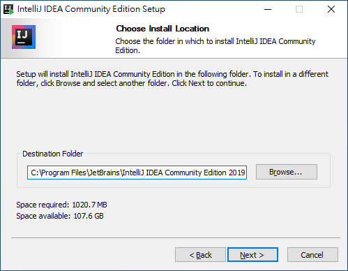
    
4. 安裝設定，勾選右上角checkbox -> Next
    
    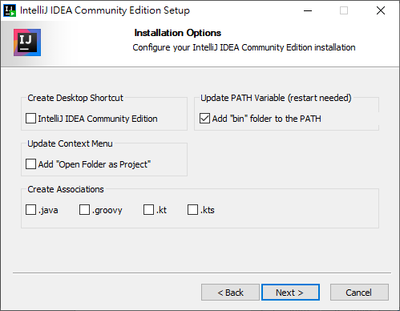
    
5. Windows 開始捷徑目錄 ->
    
    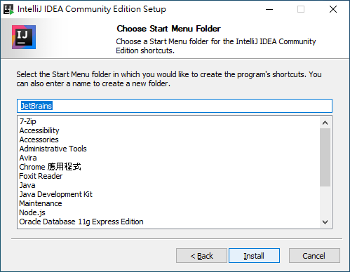
    
6. 安裝完成
    
    
    
7. 啟動並設定，是否引入設定檔 -> 否 -> OK
    
    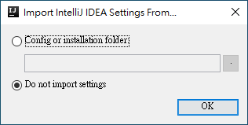
    
8. 隱私權政策聲明 -> accept -> continue
    
    
    
9. 是否提供使用數據 -> 二者皆可
    
    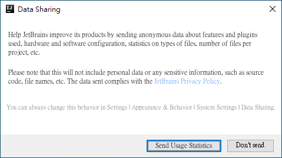
    
10. UI theme 設定 -> 選喜歡的 -> Next
    
    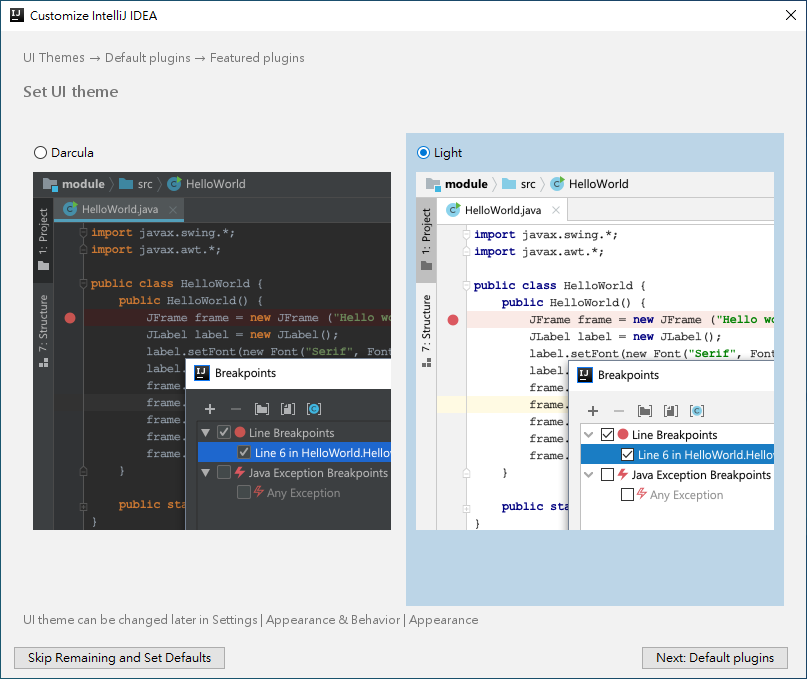
    
11. plugins 客製化 -> Next
    
    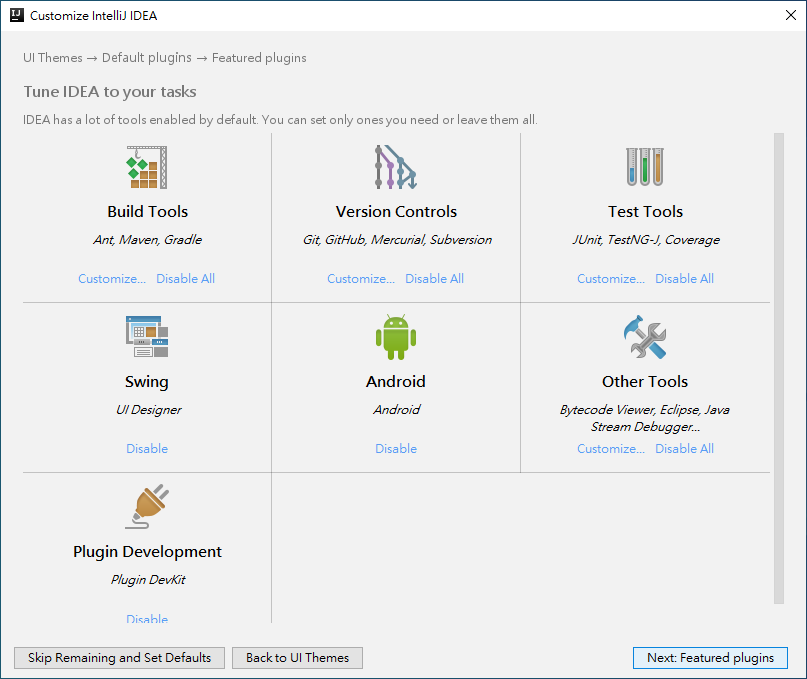
    
12. IntelliJ 推薦插件 -> Start using
    
    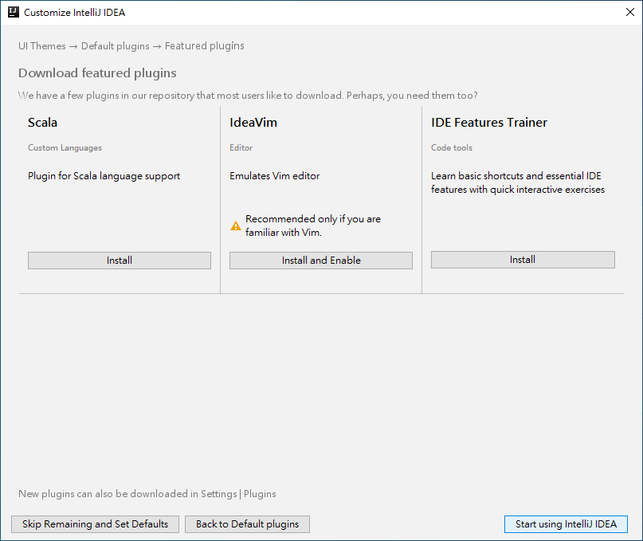
    
13. 安裝完成
    
    
    
## 安裝 Lombok 插件
> 新版 IntelliJ Idea 已預設安裝, 以下步驟可略過
> 

1. 為了使之後 Java 專案中的 Lombok 函式庫能正常使用，IntelliJ 需要安裝該插件
2. 在 IntelliJ 中進入設定
    
    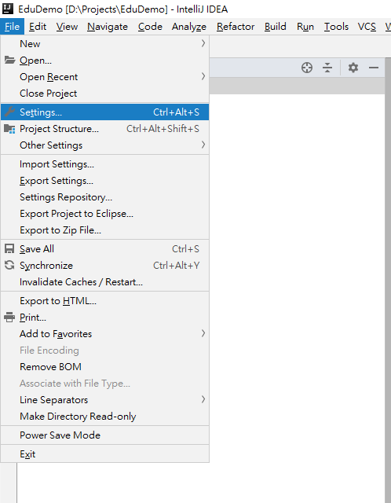
    
3. Settings 裡，設定開啟 annotation processor
    - Build, Execution, Deployment 中的 Compiler 中的 Annotation Processors
    - 選取 Default 並開啟 Enable annotation processing
    
    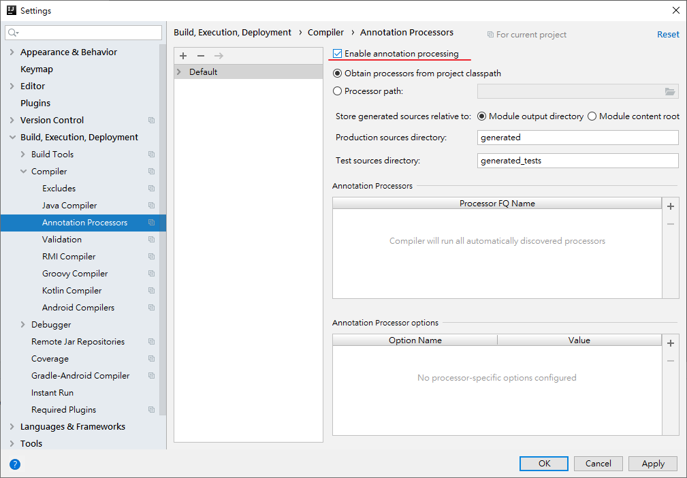
    
4. 接著在 Plugins 中的 Marketplace 搜尋 lombok 並安裝
    
    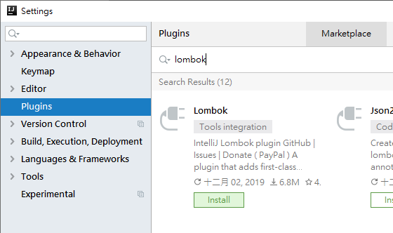
    
5. IntelliJ 警告第三方插件安裝， Accept 接受
    
    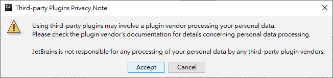
    
6. 重新啟動 IDE，才會生效
    
    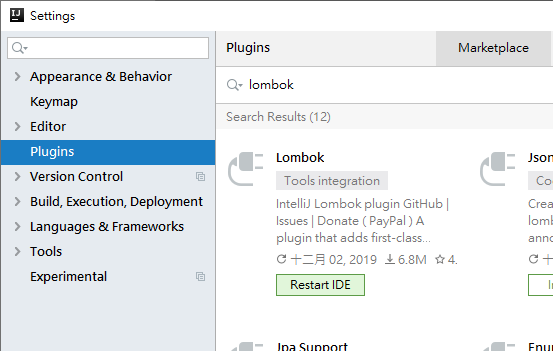