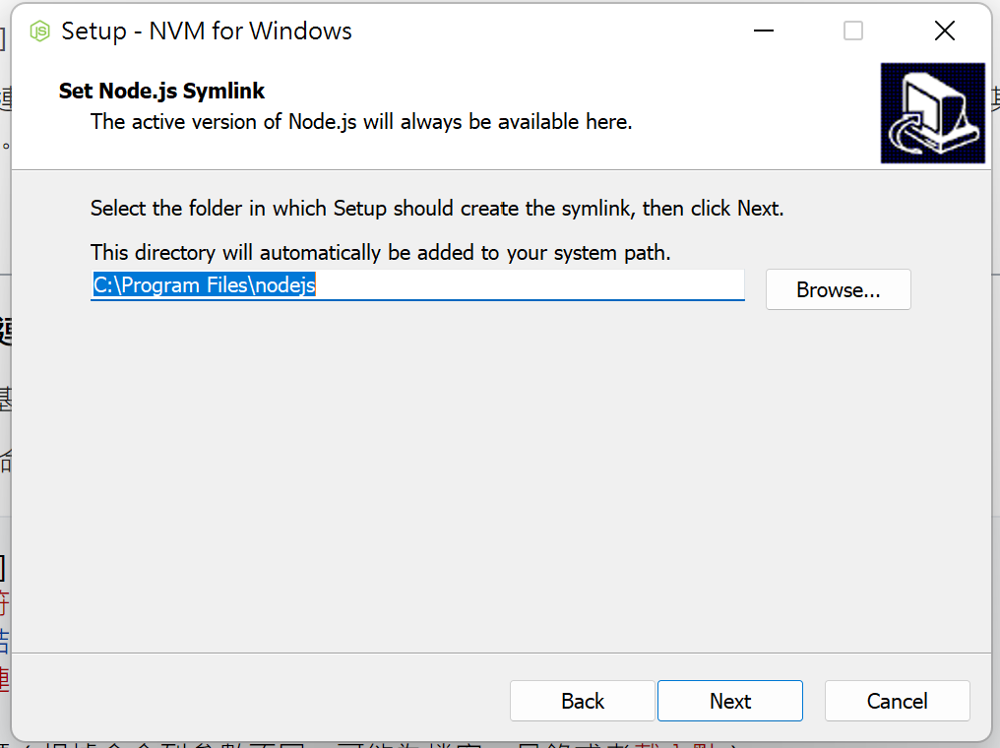

# NVM 及 Nodejs

> nvm - node version manager, 不同專案所使用的 nodejs 會不一樣, nvm 可幫助我們在不同的 nodejs 做切換
> 
1. github 網站： [https://github.com/coreybutler/nvm-windows](https://github.com/coreybutler/nvm-windows)
2. 下載 v1.1.9
    
    
    
3. 選擇 nvm-setup.exe
    
    
    
4. 選擇安裝 nvm 位置 -> 沒要換就 Next
    
    
    
5. 選擇連結 nodejs 位置  -> 沒要改就 Next
    
    
    
6. 安裝完成
7. 簡單測試，開啟 cmd 輸入
    
    ```bash
    $ nvm
    ```
    
8. nvm 正常執行則安裝完畢
    
    
    
9. 安裝 Node 版本，請安裝 Node 14 和 16
10. cmd 輸入
    
    ```bash
    nvm list available
    ```
    
11. 可以看到可安裝 node 版本
    
    
    
12. 輸入指令安裝
    
    ```bash
    nvm install 14.19.3
    ```
    
13. 安裝完成後切換
    
    ```bash
    nvm use 14.19.3
    ```
    
    
