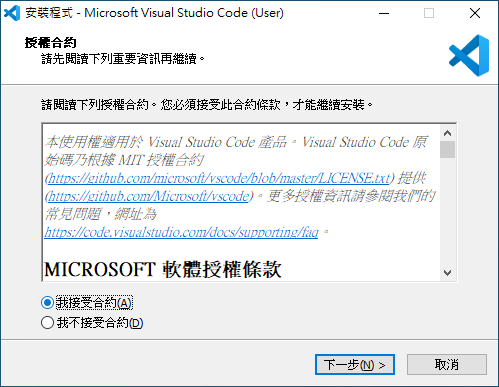
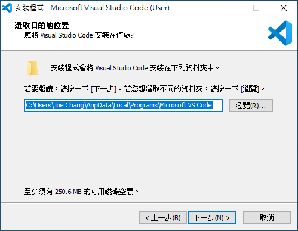
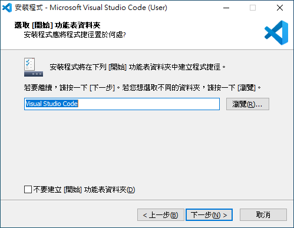
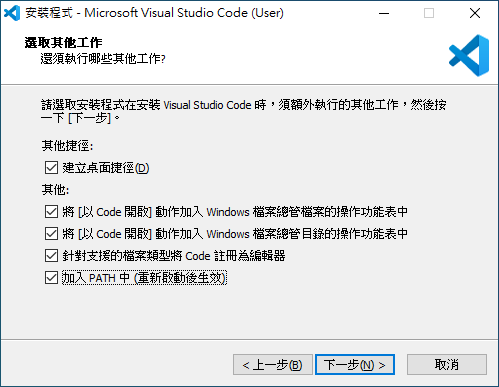
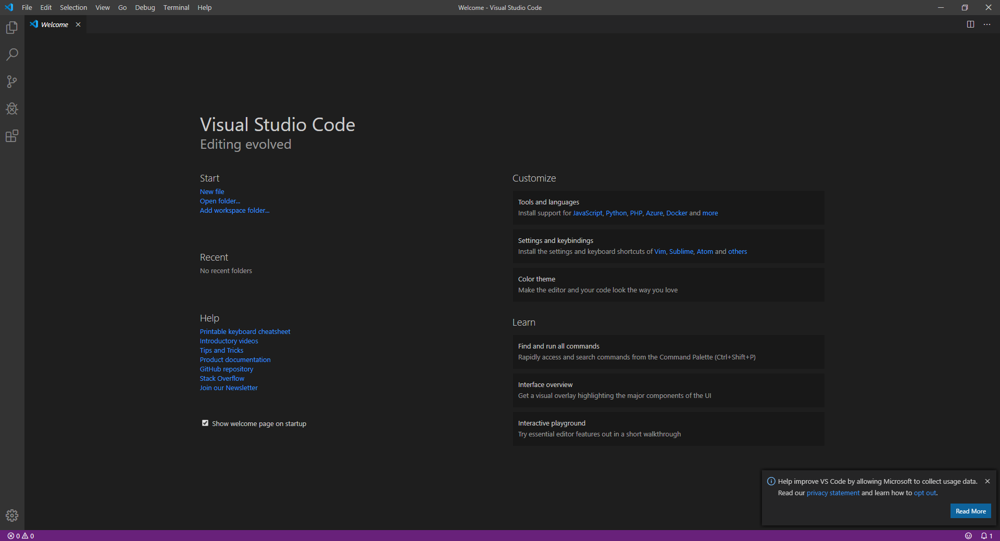
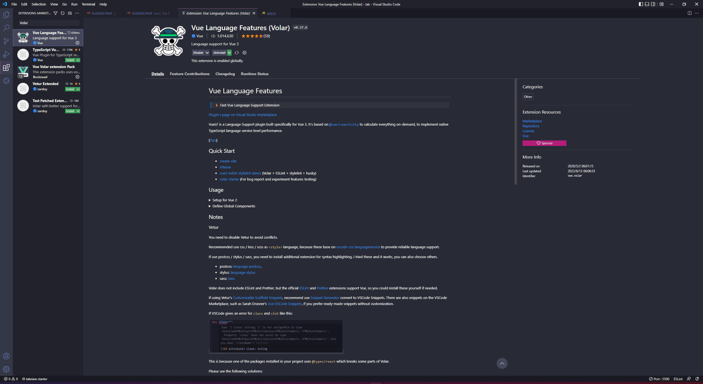
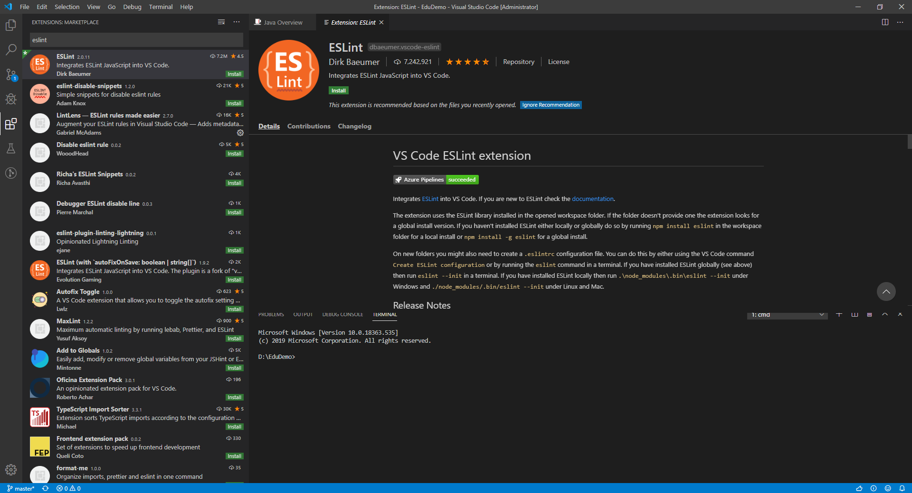
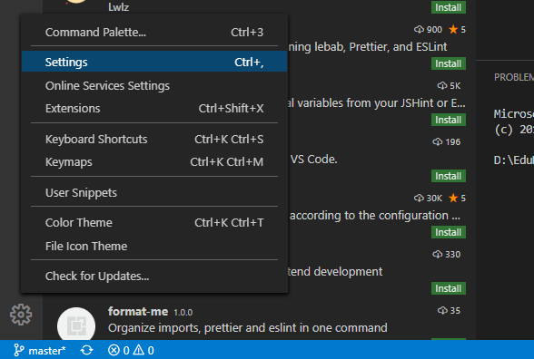
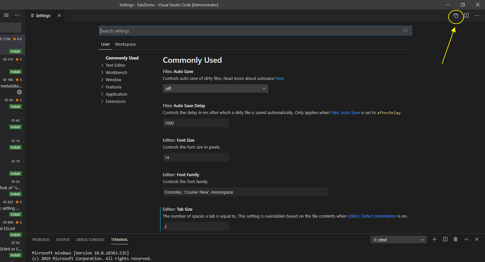
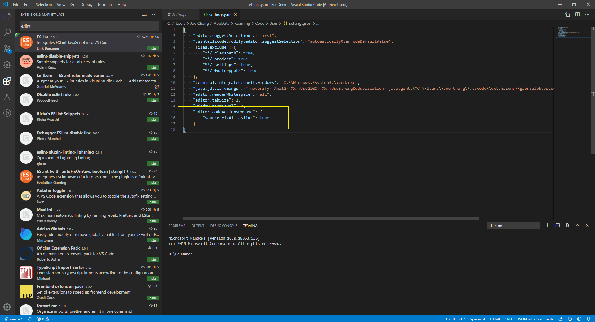

# VS Code
> 請安裝當前最新版本
> 
1. 請至 [https://code.visualstudio.com/](https://code.visualstudio.com/) 下載Visual Studio Code
2. 開始安裝 -> 接受合約( 請閱讀再繼續 ) -> 下一步
    
    
    
3. 選擇安裝位置 -> 沒要改就下一步
    
    
    
4. 在 Windows [ 開始 ] 裡資料夾捷徑設置 -> 沒要改就下一步
    
    
    
5. 其他的客製化 -> 沒要改就下一步
    
    
    
6. 安裝設定一覽，沒問題就開始安裝
    
    
    
7. 安裝完成
    
    
    
8. 啟動的樣子
    
    
    

## Volar 插件

1. Volar 會提供 Vue 檔案編輯支援功能
2. 開啟 VSCode，安裝 Volar 插件
    
    
    

## Eslint 插件

1. 讓 VS Code 會根據 eslintrc.js 配置，自動排版
2. 開啟 VSCode，安裝 Eslint 插件
    
    
    
3. 開啟 左下設定
    
    
    
4. 點選開啟 Settings JSON
    
    
    
5. 加入以下設定
    
    ```
    "editor.codeActionsOnSave": {
        "source.fixAll.eslint": true
    }
    
    ```
    
    
    