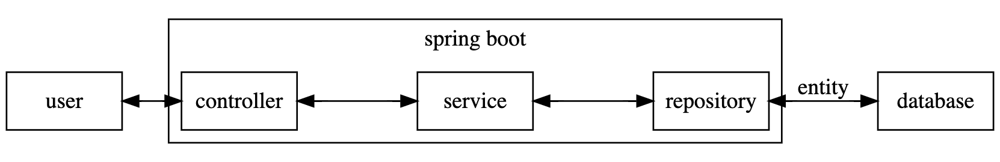
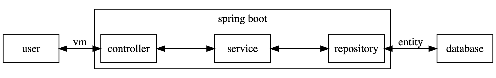

# 三. 開發範例 前端 Vue.js 後端 Spring Boot 使用 Oracle Database
###### tags: `latest`
> 範例使用 Windows 10 x64 平台，範例 EduDemo 專案建置在 D:/Projects 資料夾路徑底下
> 讀者可以更換置想要的路徑下建置專案，以下會以 ${your_path} 代稱 EduDemo 的上一層路徑


## 資料從 Database 到 Web API，透過 Spring Boot 存取 Employees 資料表

* Spring boot server 掌管了資料從資料庫進出的管控
* Spring boot 開發常見的模式，將分成四個部分
    * Entity 負責對資料庫的資料表格式映射
    * Repository 負責處理對資料庫存取的方法
    * Service 負責架接 Controller 及 Repository，資料驗證及轉型等商業邏輯的應用
    * Controller 負責控管使用者資料的輸入輸出

   

1. 以 Employees 資料表為範例，在 server/src/main/java/com/aic/edudemo 下
    * 建立 domain 資料夾，在 domain 建立 Employee.java
    * 建立 repository 資料夾，在 repository 建立 EmployeeRepository.java
    * 建立 service 資料夾，在 service 建立 EmployeeService.java
    * 建立 web 資料夾和子資料夾 controller，在 controller 建立 EmployeeController.java
2. 接下來會完成一個範例，從 education 資料表 Employees 取得資料，透過 Spring boot 處理後，在  http://localhost:8080/api/employees 顯示 json 格式的 Employees 資料表
    
2. 目前建置好的 server 專案結構如下
    ```
    src
    +---main
    |   +---java
    |   |   \---com
    |   |       \---aic
    |   |           \---edudemo
    |   |               |   ServerApplication.java
    |   |               |   ServletInitializer.java
    |   |               |
    |   |               +---domain
    |   |               |       Employee.java
    |   |               |
    |   |               +---repository
    |   |               |       EmployeeRepository.java
    |   |               |
    |   |               +---service
    |   |               |       EmployeeService.java
    |   |               |
    |   |               \---web
    |   |                   \---controller
    |   |                           EmployeeController.java
    |   |
    |   \---resources
    |       |   application.yml
    |       |
    |       +---static
    |       \---templates
    \---test
        \---java
            \---com
                \---aic
                    \---edudemo
                            ServerApplicationTests.java
    ```
### 前置步驟: Spring Boot 專案函式庫引入 Oracle jdbc
* JDBC 是 java 連線資料庫底層的解決方案
* Spring Initializr 中 Dependencies 沒有提供 Oracle JDBC 函式庫
* 因此在 server/build.gradle 設定添加
    * build.gradle 負責專案中函式庫相依性的設定
    * 以下片段表示目的是從 jcenter 中導入 ojdbc8
    ```groovy
    ...
    repositories {
    ...
        mavenCentral()
    ...
    }
    ...
    dependencies {
    ...
        runtimeOnly 'com.oracle.database.jdbc:ojdbc8:21.3.0.0'
    ...
    }
    ```
### 前置步驟: 資料庫連線 DataSource 連線池設定

1. 在 server/src/main/resouces/application.yml 中新增新增下列片段後則設定完成
    * username 跟 passward，使用先前設定的 education 以及密碼 welcome1
    * url 格式會由資料庫廠商提供，每家資料庫有些許差異
    * driver-class-name 指的是先前導入的 oracle jdbc 函式庫名稱
    ```yaml
    spring:
      datasource:
        username: vuedemo
        password: welcome1
        url: jdbc:oracle:thin:@192.168.100.165:1521/orcl
        driver-class-name: oracle.jdbc.OracleDriver
    ```

1. 測試: 啟動 Spring boot server 專案
    * 在這邊若是資料設定錯誤，則不會正常啟動，請重新檢查設定
    ```shell
    $ cd ${your_path}/EduDemo
    $ gradlew bootRun
    ``` 

### 將 Employee.java 撰寫成 Entity 元件
* Entity 是對照資料庫的資料表的 java bean
* 建立 Repository 需要使用到 Entity

2. 在 domain/Employee.java 中撰寫
    * @Entity 告知框架註冊此類別為 Entity
    * @Table 用以對應資料庫表單名稱
    * @Id 用以對應資料庫表單 primary key
    * @Data 會建立和覆寫 getter, setter, toString, hashCode, equals 等方法
    ```java
    package com.aic.edudemo.domain;
    
    // 請注意引用的部分
    import java.math.BigDecimal;
    import java.time.LocalDate;
    import javax.persistence.Entity;
    import javax.persistence.Id;
    import javax.persistence.Table;
    import lombok.Data;
    
    // 請撰寫以下的部分.....
    @Data
    @Entity
    @Table(name = "EMPLOYEES")
    public class Employee {

      @Id
      private Integer employeeId;

      private String firstName;

      private String lastName;

      private String email;

      private String phoneNumber;

      private LocalDate hireDate;

      private String jobId;

      private BigDecimal salary;

      private BigDecimal commissionPct;

      private Integer managerId;

      private Integer departmentId;

    }
    // 請撰寫以上的部分.....
    
    
    // 以下部分不用撰寫，這是匯入 EDU.sql 中 Employees 資料表的格式，用以參照
	// CREATE TABLE "EMPLOYEES"  ( 
	// "EMPLOYEE_ID"   	NUMBER(6) NOT NULL,
	// "FIRST_NAME"    	VARCHAR2(20 BYTE) NULL,
	// "LAST_NAME"     	VARCHAR2(25 BYTE) NOT NULL,
	// "EMAIL"         	VARCHAR2(25 BYTE) NOT NULL,
	// "PHONE_NUMBER"  	VARCHAR2(20 BYTE) NULL,
	// "HIRE_DATE"     	DATE NOT NULL,
	// "JOB_ID"        	VARCHAR2(10 BYTE) NOT NULL,
	// "SALARY"        	NUMBER(8,2) NULL,
	// "COMMISSION_PCT"	NUMBER(2,2) NULL,
	// "MANAGER_ID"    	NUMBER(6) NULL,
	// "DEPARTMENT_ID" 	NUMBER(4) NULL,
	// CONSTRAINT "EMP_EMP_ID_PK" PRIMARY KEY("EMPLOYEE_ID")
	// NOT DEFERRABLE VALIDATE 
	// );    
    ```
3. 測試: 撰寫完成後啟動 server，若可順利啟動進行下一步驟

### 撰寫 EmployeeRepository.java
* Repository 負責處理對資料庫存取的方法
* JpaRepository 來自 spring data jpa 函式庫，繼承他的介面會有基礎的 SQL 新刪修查方法

1. 在 EmployeeRepository.java 中撰寫
    * @Repository 告知框架註冊此 interface 為 Repository 元件
    * 此介面繼承 JpaRepository
    * JpaRepository 的泛型中填入 Entity 元件，該 Entity 中 @Id 標註屬性的物件類別
    ```java
    package com.aic.edudemo.repository;
    
    // 請注意引用的部分
    import com.aic.edudemo.domain.Employee;
    import org.springframework.data.jpa.repository.JpaRepository;
    
    // 請撰寫以下的部分.....
    @Repository
    public interface EmployeeRepository extends JpaRepository<Employee,Integer> {
    
    }
    // 請撰寫以上的部分.....
    ```
4. 測試: 完成後撰寫一份測試碼，檢驗是否能夠從正常的從資料庫取資料
5. 在 src/****test****/java/com/aic/edudemo/ServerApplicationTests.java 中撰寫
    * @SpringBootTest 會在測試執行中建置並導入框架設定與元件
    * @Autowired 會將框架的註冊的元件引入
    * @Test 告知框架註冊此方法為 unit test 元件
    ```java
    package com.aic.edudemo;
    
    // 請注意引用的部分
    import static org.junit.jupiter.api.Assertions.assertNotNull;
    import com.aic.edudemo.repository.EmployeeRepository;
    import org.junit.jupiter.api.Test;
    import org.springframework.beans.factory.annotation.Autowired;
    import org.springframework.boot.test.context.SpringBootTest;
    
    @SpringBootTest
    class ServerApplicationTests {
    
        // 請撰寫以下的部分.....
        @Autowired
        private EmployeeRepository employeeRepository;
        // 請撰寫以上的部分.....

        @Test
        void contextLoads() {
        }
        
        // 請撰寫以下的部分.....
        @Test
        void fetchAllEmployees() {
            assertNotNull(this.employeeRepository);
            this.employeeRepository.findAll().forEach(System.out::println);
        }
        // 請撰寫以上的部分.....

    }
    ```
2. 在 src/main/resources/application.yml 中撰寫
    * 設定 JPA 將執行的 SQL 語法顯示在 console
    ```yaml
    spring:
      datasource:
        username: education
        password: welcome1
        url: jdbc:oracle:thin:@localhost:1521:xe
        driver-class-name: oracle.jdbc.OracleDriver
    # 請撰寫以下的部分.....
      jpa:
        show-sql: true
        properties:
          hibernate:
            format_sql: true
    # 請撰寫以上的部分.....
    ```

1. 執行測試碼的方法可以透過 IDE 或是 gradle
    * 透過 IntelliJ 執行
        * IntelliJ 有支援測試功能，如下圖點選方法旁的 Run Test
        
    * 透過 gradle 執行
        * 執行以下指令，獲得測試檔案 TEST-com.aic.edudemo.ServerApplicationTests.xml
        ```shell
        $ cd ${your_path}/EduDemo/server
        $ gradlew test --tests ServerApplicationTests.fetchAllEmployees
        ```
        * 測試結果在 server/build/test-results/test 資料夾中


### 撰寫 EmployeeService.java
* Service 負責架接 Controller 及 Repository，資料驗證及轉型等商業邏輯的應用
* 在 EmployeeService 中引用 EmployeeRepository

1. 在 EmployeeService.java 中撰寫
    * @AllArgsConstructor 會建立一個包含所有屬性的建構子
    * @Service 告知框架註冊此類別為 Service 元件
    ```java
    package com.aic.edudemo.service;
    
    // 請注意引用的部分
    import java.util.List;
    import com.aic.edudemo.domain.Employee;
    import com.aic.edudemo.repository.EmployeeRepository;
    import org.springframework.stereotype.Service;
    import lombok.AllArgsConstructor;
    
    // 請撰寫以下的部分.....
    @AllArgsConstructor
    @Service
    public class EmployeeService {

      private final EmployeeRepository employeeRepository;

      public List<Employee> findAll() {
        return this.employeeRepository.findAll();
      }
    
    }
    // 請撰寫以上的部分.....
    ```


### 撰寫 EmployeeController.java
* Controller 負責控管使用者資料的輸入輸出
* 在 EmployeeController 中引用 EmployeeService

1. 在 EmployeeController.java 中撰寫
    * @RestController 告知框架註冊此類別為 Controller 元件
    * @RequestMapping 設定路徑 
    * @GetMapping 設定路徑和 http 方法
    * 綜合以上兩個 Mapping 註冊了 /api/employees 路徑的 GET method
    ```java
    package com.aic.edudemo.web.controller;
    
    // 請注意引用的部分
    import com.aic.edudemo.service.EmployeeService;
    import org.springframework.web.bind.annotation.GetMapping;
    import org.springframework.web.bind.annotation.RequestMapping;
    import org.springframework.web.bind.annotation.RestController;
    import lombok.AllArgsConstructor;
    
    // 請撰寫以下的部分.....
    @AllArgsConstructor
    @RestController
    @RequestMapping("/api")
    public class EmployeeController {

      private final EmployeeService employeeService;

      @GetMapping("/employees")
      public Object findEmployees() {
          return this.employeeService.findAll(); 
      }
      
    }
    // 請撰寫以上的部分.....
    ```
1. 測試: 接著啟動 server 後連線至 http://localhost:8080/api/employees
    
    ```shell
    $ cd ${your_path}/EduDemo
    $ gradlew bootRun
    ```
    * 開啟瀏覽器訪問
    

    * 開啟 postman 訪問
    


## 透過 Vue.js 專案讓資料從後端顯示到瀏覽器


* 接下來透過 Vue.js 專案開發瀏覽器所需要的畫面
    

* 製作一個 Demo.vue 的元件，在網址切換到 /demo 的時候，會自動下載 Employees 的資料，並用 Table 格式顯示在畫面上


::: tip
Quasar 提供了許多 UI 的套件，下面的官網有相關使用的介紹
* https://quasar.dev/start/pick-quasar-flavour

Axios 的 Github，這裡可以查到相關的用法
* https://github.com/axios/axios

Vue.js API 相關文件
* https://vuejs.org/api/
:::


### 前置步驟: 避免 server port 衝突
* 為了避免啟動時違反跨域原則([CORS](https://developer.mozilla.org/zh-TW/docs/Web/HTTP/CORS))

1. 在 client/quasar.config.js 中撰寫
    ```javascript
    module.exports = {
    ...
      devServer: {
        proxy: {
	        '/api': {
		        target:  'http://localhost:8080/',
		        changeOrigin:  true
	        }
        }
      }
    ...
    }
    ```
### 前置步驟: 改變axios預設路徑
1. 將 client/src/boot/axios改成
 

### Demo.vue 的新增與路徑設置

1. 目前在 src/router/route.js 中記載了目前對應到 layouts/MainLayout.vue 以及 pages/IndexPage.vue 的路徑配置，在這邊新增一個配給 Demo.vue 的路徑

1. 在 src/router/routes.js 中的 routes 物件中新增以下片段，
    * Vue Router 提供兩種 path 或 name 映射方式 
     ```javascript
     const routes = [
     ...
      {
        path: '/demo',
        name: 'demo',
        component: () => import('../pages/DemoPage.vue')
      }
     ...
     ]

     ```
1. 接著在 src/pages 資料夾下新增 Demo.vue 檔案

1. 在 Demo.vue 寫入以下程式碼
    * template 區塊撰寫 html 相關語法
    * style 區塊撰寫 css 相關語法
    * script 區塊撰寫 javascript 相關語法
    * `{ { text } }` 是 Vue.js 中 v-text 的語法簡易型
    ```vue
    <template>
      <div>
        <h1>demo</h1>
        <p>{{hey}}</p>
      </div>
    </template>

    <script setup>
    import { ref } from 'vue'
    const hey = ref("hello world");
    </script>
    
	<style lang="scss" scoped></style>

    ```
    ::: tip
     VS Code在安裝流程中裝載 Volar後，在 vue 檔案中輸入 vue 會有範本樣式可選擇
     
    :::

1. 測試: 至 http://localhost:9000/#/demo 觀看結果
    
 


### 使用 axios 對後端請求資料

1. 接下來為了向 Spring Boot 取得 Employees 資料，在 Demo.vue 中撰寫相關的程式碼

2. 首先是引入 axios 和 vue 生命週期方法，在 Demo.vue 增加以下片段
    ```javascript
    <script>
    import { api } from  'src/boot/axios'
    import { ref, onMounted } from  'vue'
    </script>
    ```
3. 接下來定義 data，用來承接 Employees 資料
     ```javascript
    <script setup>
    import { api } from  'src/boot/axios'
    import { ref, onMounted } from  'vue'
   
   let employees = ref([])
   
    </script>
    ```
4. 接著撰寫 onMounted 函式中撰寫 axios，onMounted 函式會在 Vue 元件建立時執行，axios 則會向後端 spring 請求資料, 這邊注意, 在使用ref時, 必須將資料指定到
	```javascript
	變數.value 
	```
    ```javascript
    <script>
    <script setup>
    import { api } from  'src/boot/axios'
    import { ref, onMounted } from  'vue'
   
   let employees = ref([])

	onMounted(() => {
		api.get('/employees').then(response => {
		  employees.value  =  response.data
		})
	})
   
    </script>
    ```
6. 最後在 template 中改成下列片段，讓回呼得到的資料顯示在畫面上
    ```html
    <template>
      <div>
        <h1>demo</h1>
        <p>{{employees}}</p>
      </div>
    </template>
    ```

7. 測試: 至 http://localhost:9000/#/demo 觀看結果是否有顯示 Employees 資料
    
    
### 使用 Quasar 製作 Table 畫面

1. 接下來將 Demo.vue 的畫面美化，讓資料呈現表單的樣式

1. 這邊使用 Quasar Layout 中提供的 Flex Grid 系統，將 template 改成
    ```html
    <template>
      <div class="q-pa-xl">
          <div class="row">
            <div class="col">
            </div>
          </div>
      </div>
    </template>
    ```
1. 接著更改 template，加入 q-table
    * 使用冒號 : 的語法是 Vue 的 v-bind 中的簡易版語法
        * :rows 對應的是表單資料，填入 employees
        * :columns 對應的是表單欄位設定，先填入 columns 下一步在設定
    ```html
    ...
    <div class="col">
      <q-table
        title="Employee"
        :rows="employees"
        :columns="columns"
      >
      </q-table>
    </div>
    ..
    ```

1. 接下來綁定的 :columns 需要設定表單的欄位設定
    * label: 設定顯示在表單欄位的標頭名稱
    * field: 設定表單資料要如何從 :rows 物件中取得
    ```javascript
    ...
    data () {
        return {
          columns: [
            { label: 'Employee ID', field: row => row.employeeId },
            { label: 'First Name', field: row => row.firstName },
            { label: 'Last Name', field: row => row.lastName },
            { label: 'Email', field: row => row.email },
            { label: 'Phone Number', field: row => row.phoneNumber },
            { label: 'Salary', field: row => row.salary },
            { label: 'Hire Date', field: row => row.hireDate },
            { label: 'Job ID', field: row => row.jobId },
            { label: 'Department ID', field: row => row.departmentId }
          ],
          employees: []
        }
      }
    ...
    ```
1. 測試: 至 http://localhost:9000/#/demo 觀看結果
    * 右下方有顯示資料比數的調整
    
    


## 進階範例: 客製化 Employees 的查詢以及新增、修改、刪除

### 分頁式查詢

* 在先前的查詢中將資料庫表單的資料一次取得，若是表單龐大會有很大的問題，接下來講解分頁式的資料取得

#### Spring Boot: Page 物件的使用

1. 更改 EmployeeService
    * 將原先的方法加入 Pageable 參數，回傳物件 List 改為 Page
    ```java
    ...
    import org.springframework.data.domain.Page;
    import org.springframework.data.domain.Pageable;
    ...
    public class EmployeeService {
    ...
      public Page<Employee> findAll(Pageable pageable) {
        return this.employeeRepository.findAll(pageable);
      }
    ...
    }
    ```

1. 更改 EmployeeController
    * 將原先的方法加入 Pageable 的參數
    ```java
    ...
    import org.springframework.data.domain.Pageable;
    ...
    public class EmployeeController {
    ...
      @GetMapping("/employees")
      public Object findEmployees(Pageable pageable) {       
          return this.employeeService.findAll(pageable);
      }
    ...
    }
    ```
1. 測試: 試著使用 POSTMAN 訪問 http://localhost:8080/api/employees
    * response body 結構已改變，content 只有 20 筆資料

    

1. 預設的情況等同 http://localhost:8080/api/employees?page=0&size=20
    * 請試著改變 page 跟 size 的值
    * 請注意 page 從 0 開始

#### Vue.js: 使用 q-table pagination 功能

1. 更改 Demo.vue
    * 為了正常顯示資料 reponse.data 更動為 reponse.data.content
    ```javascript
    ...
    onMounted(() => {
		api.get('/employees').then(response => {
		  employees.value  =  response.data.content
		})
	})
    ...
    ```
2. 不過因為目前只有取的前 20 筆的資料且每頁顯示 5 筆資料，接下來要修改成能夠取所有資料並且每頁顯示 20 筆

3. 先從 q-table 改起，需要在新增以下片段，作為 pagination 資料與 event 的綁定
    ```html
    ...
      <q-table
        title="Employee"
        :rows="employees"
        :columns="columns"
        :pagination.sync="pagination"
        @request="alterPagination"
      >
      </q-table>
    ...
    ```
4. 因為 pagination 以及 alterPagination 更動以下片段
    ```javascript
    <script setup>
    ...
    let pagination = ref({})
    function alterPagination (args) {
        // 觸發後改寫回呼參數
	}
	...
	<script>
    ```
4. 接下來更改 axios 回呼的方法，撰寫 callGetEmployees，在呼叫時會傳入依照 request.getEmployees 的內容請求
    * q-table 中的 page 則是從 1 開始
    ```javascript
    // 上面 import 多引進 reactive
    ...
    import { ref, onMounted, reactive } from 'vue'
    ...

    ...
    let request = reactive ({
      getEmployees: {
          method: 'GET',
          url: '/employees',
          params: {}
	  }
    })
    async function callGetEmployees () {
      // 回呼資料
      let response = await api(request.getEmployees)
      // 回傳後更新 employees 資料
      employees.value = response.data.content
      // 回傳後更新 pagination 資料
      pagination.value.rowsNumber = response.data.totalElements
      pagination.value.rowsPerPage = response.data.size
      pagination.value.page = response.data.number + 1
    },
    alterPagination (args) {
        .....
    }
    ```
5. request.getEmployees.params 初始為空值，會等同請求 /api/employees，在畫面一開始時先呼叫取得前 20 筆資料，onMounted 更改如下
    ```javascript
    ...
    onMounted(() => {
		callGetEmployees()
	})
    ...
    ```
    
6. 在上下頁觸發時，資料也要更動，所以最後在 alterPagination 中改成下列片段
    ```javascript
    ...

    async callGetEmployees () {
      ...
    },
    alterPagination (args) {
      // 觸發後改寫回呼參數
      request.getEmployees.params.page = args.pagination.page - 1
      request.getEmployees.params.size = args.pagination.rowsPerPage
      callGetEmployees()
    }

    ...
    ```

7. 現在可以到 http://localhost:9000/#/demo 看看分頁的功能
    
  
### 查詢資料的篩選

* Employee 中有許多屬性，篩選的目標各屬性有所差別，接下來要將資料篩選功能加入範例

    | 屬性          | 目標                               |
    | ------------- | ---------------------------------- |
    | firstName     | 查詢包含有該字串的目標，無視大小寫 |
    | lastName      | 查詢包含有該字串的目標，無視大小寫 |
    | email         | 完全符合字串                       |
    | phoneNumber   | 完全符合字串                       |
    | salaryFrom    | salary 範圍的最小值                |
    | salaryTo      | salary 範圍的最大值                |
    | hireDateFrom  | hireDate 範圍的起始日期            |
    | hireDateTo    | hireDate 範圍的截止日期            |
    | jobId         | 單選，查找 Jobs PK值               |
    | departmentIds | 複選，查找 Departments PK值        |


#### Spring Boot: VM 的使用
* 當查詢用的格式跟 Entity 格式有所出入時，可建立 VM 的 java bean 當作存放容器
* 以下用 EmployeeRequestVM 作為範例
  
* 在 src/main/java/com/aic/edudemo/web/vm 下建立 EmployeeRequestVM.java
    * @JsonSetter(nulls=Nulls.SKIP) 若該屬性為 null 則跳過轉換，因此不會覆寫預設值
    * @DateTimeFormate(iso=ISO.DATE) 表示接受 yyyy-MM-dd 的日期格式
    * firstName 跟 lastName 預設值為配合 SQL Like 語法
    * hireDateFrom 跟 hireDateTo 預設值為配合 SQL Between 語法
    * salaryFrom 跟 salaryTo 預設值為配合 SQL Between 語法
    ```java
    package com.aic.edudemo.web.vm;
    
    // 請注意引用的部分
    import java.math.BigDecimal;
    import java.time.LocalDate;
    import java.util.List;
    import java.util.ArrayList;
    import com.fasterxml.jackson.annotation.JsonSetter;
    import com.fasterxml.jackson.annotation.Nulls;
    import org.springframework.format.annotation.DateTimeFormat;
    import org.springframework.format.annotation.DateTimeFormat.ISO;
    import lombok.Data;
    
    // 請撰寫以下部分
    @Data
    public class EmployeeRequestVM {
  
      @JsonSetter(nulls = Nulls.SKIP)
      private String firstName = "%";

      @JsonSetter(nulls = Nulls.SKIP)
      private String lastName = "%";

      private String email;

      private String phoneNumber;

      @DateTimeFormat(iso = ISO.DATE)
      @JsonSetter(nulls = Nulls.SKIP)
      private LocalDate hireDateFrom = LocalDate.parse("0001-01-01");

      @DateTimeFormat(iso = ISO.DATE)
      @JsonSetter(nulls = Nulls.SKIP)
      private LocalDate hireDateTo = LocalDate.parse("9999-12-31");

      private String jobId;

      @JsonSetter(nulls = Nulls.SKIP)
      private BigDecimal salaryFrom = BigDecimal.valueOf(0);

      @JsonSetter(nulls = Nulls.SKIP)
      private BigDecimal salaryTo = BigDecimal.valueOf(99999999.99);
    
      private List<Integer> departmentIds = new ArrayList<>();

    }
    // 請撰寫以上部分
    ```
#### Spring Boot: Repository 自訂 SQL 語句 
* 當 JpaRepository 提供的 SQL 方法不符需求時，可透過 @Query 註解自定義 SQL 語句
* 更動 EmployeeRepository 
    * 撰寫一個使用標註 @Query 的方法 findEmployees
    * 標註 @Param 的參數才能在 SQL 中使用，像範例使用 selector
    * 範例中的語法像 :#{#selector.lastName} 是使用 SpEL 的語法
    ```java
    package com.aic.edudemo.repository;
    
    // 請注意引用的部分
    import com.aic.edudemo.domain.Employee;
    import com.aic.edudemo.web.vm.EmployeeRequestVM;
    import org.springframework.data.domain.Page;
    import org.springframework.data.domain.Pageable;
    import org.springframework.data.jpa.repository.JpaRepository;
    import org.springframework.data.jpa.repository.Query;
    import org.springframework.data.repository.query.Param;
    import org.springframework.stereotype.Repository;

    @Repository
    public interface EmployeeRepository extends JpaRepository<Employee, Integer> {

        // 請撰寫以下部分.....
        @Query("Select e From Employee e"
        +" Where Upper(e.lastName) Like Upper(:#{#selector.lastName})"
        +" And Upper(e.firstName) Like Upper(:#{#selector.firstName})"
        +" And ( e.email = :#{#selector.email} OR :#{#selector.email} Is Null )"
        +" And ( e.phoneNumber = :#{#selector.phoneNumber} OR :#{#selector.phoneNumber} Is Null )"
        +" And ( e.salary Between :#{#selector.salaryFrom} And :#{#selector.salaryTo} )"
        +" And ( e.hireDate Between :#{#selector.hireDateFrom} And :#{#selector.hireDateTo} )"
        +" And ( e.jobId = :#{#selector.jobId} OR :#{#selector.jobId} is Null )"
        +" And ( e.departmentId IN :#{#selector.departmentIds.size() != 0 ? #selector.departmentIds : null} OR :#{#selector.departmentIds.size() != 0 ? #selector.departmentIds.size() : null} is Null)"
        )
        Page<Employee> findEmployees(Pageable pageable, @Param("selector") EmployeeRequestVM employeeRequestVM);
        // 請撰寫以上部分.....
    
    }
    ```
    *以下採用nativeSQL寫法(專案中較為常用)
   ```java
   @Query(nativeQuery = true,  
  value = "Select * From EMPLOYEES e" +  
        " Where Upper(e.last_name) like Upper(:lastname)" +  
        " And Upper(e.first_Name) Like Upper(:firstname)" +  
        " And ( e.email = :email or :email is null )" +  
        " And ( e.phone_Number = :phoneNumber or :phoneNumber is null )" +  
        " And ( e.salary Between :salaryFrom And :salaryTo )" +  
        " And ( e.hire_Date Between :hireDateFrom And :hireDateTo )" +  
        " And ( e.job_Id = :jobId or :jobId is null )" +  
        " And ( :size = 0 or e.department_Id IN :departmentIds )",  
  countQuery = "Select count(*) From EMPLOYEES e" +  
                " Where Upper(e.last_name) like Upper(:lastname)" +  
                " And Upper(e.first_Name) Like Upper(:firstname)" +  
                " And ( e.email = :email or :email is null )" +  
                " And ( e.phone_Number = :phoneNumber or :phoneNumber is null )" +  
                " And ( e.salary Between :salaryFrom And :salaryTo )" +  
                " And ( e.hire_Date Between :hireDateFrom And :hireDateTo )" +  
                " And ( e.job_Id = :jobId or :jobId is null )" +  
                " And ( :size = 0 or e.department_Id IN (:departmentIds) )")  
	Page<Employee> nativeFindEmployee(Pageable pageable,  
	  @Param("lastname") String lastname,  
	  @Param("firstname") String firstname,  
	  @Param("email") String email,  
	  @Param("phoneNumber") String phoneNumber,  
	  @Param("salaryFrom") BigDecimal salaryForm,  
	  @Param("salaryTo") BigDecimal salaryTo,  
	  @Param("hireDateFrom")LocalDate hireDateFrom,  
	  @Param("hireDateTo")LocalDate hireDateTo,  
	  @Param("jobId")String jobId,  
	  @Param("departmentIds") List<Integer> departmentIds,  
	  @Param("size")Integer size);
  
#### Spring Boot: 在 Service 撰寫驗證
* Repository 以及 Controller 無法處理的格式問題，在 Service 中解決 
* 在 EmployeeService 中更改
    * 新增 findEmployees 和 format 方法
    * lastName 或 firstName 存在時，添加 like 語句使用的 wildcard
    ```java
     ...
      public Page<Employee> findEmployees(Pageable pageable, EmployeeRequestVM employee) {
        this.format(employee);
        return this.employeeRepository.findEmployees(pageable, employee);
      }
    
      private EmployeeRequestVM format(EmployeeRequestVM employee) {
        if(!Objects.equals(employee.getFirstName(), "%")) employee.setFirstName("%" + employee.getFirstName() + "%");
        if(!Objects.equals(employee.getLastName(), "%")) employee.setLastName("%" + employee.getLastName() + "%");
        return employee;
      }
     ...
    ```
#### Spring Boot: Controller 使用 VM 及 ModelAttribute
* 在 EmployeeController 中更動以下片段
    * 原先的 findEmployees 方法路徑更改為 /employees/all
    * 新增另一個 findEmployees 方法路徑使用原本的 /employees，並且接受 EmployeeRequestVM 參數
    * 像 /employees?lastName=Albert&firstName=Johnson 因為標註 @ModelAttribute，lastName 跟 firstName 會自動裝載到 EmployeeRequestVM 裡面

    ```java
    ...
      @GetMapping("/employees/all")
      public Object findEmployees(Pageable pageable) {
          return this.employeeService.findAll(pageable);
      }

      @GetMapping("/employees")
      public Object findEmployees(Pageable pageable, @ModelAttribute EmployeeRequestVM employee) {
        return this.employeeService.findEmployees(pageable, employee);
      }
    ...
    ```
    
#### Spring Boot: LabelValue 格式
* 當提供 q-select 元件 label 跟 value 成對的格式即可建立 select 選單
* 以 Jobs 以及 Departments 兩張資料庫資料表作為範例

1. 在 vm 資料夾下撰寫 LabelValue.java
    ```java
    package com.aic.edudemo.web.vm;

    import lombok.AllArgsConstructor;
    import lombok.Data;
    import lombok.NoArgsConstructor;

    // 請撰寫以下部分.....
    @Data
    @AllArgsConstructor
    @NoArgsConstructor
    public class LabelValue {

      private String label;

      private String value;

      private boolean selectable = true;

    }
    // 請撰寫以上部分.....
    ```

1. 建立 Department.java 為 Entity 元件
    ```java
    package com.aic.edudemo.domain;
    
    import javax.persistence.Entity;
    import javax.persistence.Id;
    import javax.persistence.Table;
    
    // 請撰寫以下部分.....
    @Data
    @Entity
    @Table(name = "DEPARTMENTS")
    public class Department {

        @Id
        private Integer departmentId;

        private String departmentName;

        private Integer managerId;

        private Integer locationId;

    }
    // 請撰寫以上部分.....
    ```
1. 建立 Job.java 為 Entity 元件
    ```java
    package com.aic.edudemo.domain;
    
    import javax.persistence.Entity;
    import javax.persistence.Id;
    import javax.persistence.Table;

    // 請撰寫以下部分.....
    @Data
    @Entity
    @Table(name = "JOBS")
    public class Job {

        @Id
        private String jobId;

        private String jobTitle;

        private BigDecimal minSalary;

        private BigDecimal maxSalary;

    }
    // 請撰寫以上部分.....
    ```
1. 建立 DepartmentRepository.java，只取用 departmentId, departmentName
    ```java
    package com.aic.edudemo.repository;

    // 請注意引入部分
    import java.util.List;
    import com.aic.edudemo.domain.Department;
    import org.springframework.data.jpa.repository.JpaRepository;
    import org.springframework.data.jpa.repository.Query;
    import org.springframework.stereotype.Repository
    
    // 請撰寫以下部分.....
    @Repository
    public interface DepartmentRepository extends JpaRepository<Department, Integer>{

      @Query("Select d.departmentId, d.departmentName From Department d")
      List<Object[]> findDepartmentLabelValue();

    }
    // 請撰寫以上部分.....
    ```
1. 建立 JobRepository.java，只取用 jobId, jobTitle
    ```java
    package com.aic.edudemo.repository;
    
    // 請注意引入部分
    import java.util.List;
    import com.aic.edudemo.domain.Job;
    import org.springframework.data.jpa.repository.JpaRepository;
    import org.springframework.data.jpa.repository.Query;
    import org.springframework.stereotype.Repository;
    
    // 請撰寫以下部分.....
    @Repository
    public interface JobRepository extends JpaRepository<Job, String>{

      @Query("Select j.jobId, j.jobTitle From Job j")
      List<Object[]> findJobLabelValue();

    }
    // 請撰寫以上部分.....
    ```
3. 建立 LabelValueService.java

    | 資料映射  | Label          | Value        |
    | --------- | -------------- | ------------ |
    | Job       | jobTitle       | jobId        |
    | Deparment | departmentName | departmentId |

    ```java
    package com.aic.edudemo.service;
    
    // 請注意引入部分
    import java.util.ArrayList;
    import java.util.List;
    import java.util.stream.Collectors;
    import com.aic.edudemo.repository.DepartmentRepository;
    import com.aic.edudemo.repository.JobRepository;
    import com.aic.edudemo.web.vm.LabelValue;
    import lombok.extern.log4j.Log4j2;
    import org.springframework.stereotype.Service;
    import lombok.AllArgsConstructor;

    // 請撰寫以下部分.....
    @AllArgsConstructor
    @Service
    @Log4j2
    public class LabelValueService {

      private final DepartmentRepository departmentRepository;

      private final JobRepository jobRepository;

      public List<LabelValue> findAllDepartmentsAsLabelValues() {
        List<Object[]> source = this.departmentRepository.findDepartmentLabelValue();
        log.info("Departments: {}", source);

        // 透過 loop 映射 label value 資料
        List<LabelValue> result = new ArrayList<>();
        for (Object[] data: source) {
          LabelValue temp = new LabelValue();
          temp.setValue(String.valueOf((Integer)data[0]));
          temp.setLabel((String)data[1]);
          result.add(temp); 
        }
        return result;
      }

      public List<LabelValue> findAllJobsAsLabelValues() {
        List<Object[]> source = this.jobRepository.findJobLabelValue();
        log.info("Jobs: {}", source);

        // 透過 lambda stream 映射 label value 資料
        return source.stream().map(data -> {
          LabelValue temp = new LabelValue();
          temp.setValue((String)data[0]);
          temp.setLabel((String)data[1]);
          return temp;
        }).collect(Collectors.toList());
      }
    }
    // 請撰寫以上部分.....

    ```
4. 建立 LabelValueController
    * 建立 /jobsLabelValues 取得 Jobs 資料
    * 建立 /departmentsLabelValues 取得 departments 資料
    ```java
    package com.aic.edudemo.web.controller;
    
    // 請注意引入部分
    import com.aic.edudemo.service.LabelValueService;
    import org.springframework.web.bind.annotation.GetMapping;
    import org.springframework.web.bind.annotation.RequestMapping;
    import org.springframework.web.bind.annotation.RestController;
    import lombok.AllArgsConstructor;

    // 請撰寫以下部分.....
    @AllArgsConstructor
    @RestController
    @RequestMapping("/api")
    public class LabelValueController {

      private final LabelValueService labelValueService;

      // GET all the Jobs as LabelValues
      @GetMapping("/jobsLabelValues")
      public Object jobsLabelValues() {
        return this.labelValueService.findAllJobsAsLabelValues();
      }

      // GET all the Departments as LabelValues
      @GetMapping("/departmentsLabelValues")
      public Object departmentsLabelValues() {
        return this.labelValueService.findAllDepartmentsAsLabelValues();
      }

    }
    // 請撰寫以上部分.....
    ```

#### Vue Project: 排版
* 除了原先的顯示資料表之外，另外要增加資料輸入欄位以及觸發的按鈕
* 因此接下來要在 template 中排版

1. 原先的顯示 Employees 表單上面新增兩個區塊，最上層留給功能按鈕做新刪修查，中間放查詢用的輸入，最下層則是原先的資料顯示，個別區塊之間已 q-separator 區隔
   * q-col-gutter-xs 控制各別 col 間的 pad 尺寸
   * col-12 col-md-2 控制 col 隨螢幕變動的尺寸
   ```html
   <template>
    <div class="q-pa-xl">
        <!-- 按鈕區塊 -->
        <div class="row q-col-gutter-xs">
          <div class="col-12 col-md-2">
            <!--   按鈕 q-btn      -->
          </div>
          <div class="col-12 col-md-2">
            <!--   按鈕 q-btn      -->
          </div>
          ...
        </div>
        <q-separator spaced />
        
        <!-- 輸入區塊 -->
        <div class="row q-col-gutter-xs">
          <div class="col-12 col-md-6">
            <!--   輸入 q-input     -->
          </div>
          <div class="col-12 col-md-6">
            <!--   輸入 q-input     -->
          </div>
          ...
        </div>
        <q-separator spaced />
        
        <!-- 顯示區塊 -->
        <div class="row">
          <div class="col">
            <q-table ...>
          </div>
        </div>

    </div>
   </template>
   ```
1. 加入一個 button ，將導入頁面就開始回呼 Employees 資料的行為，變更為點擊 button 才會進行回呼 Employees 資料
    * 在按鈕區塊中的 q-btn 在被 click 時會呼叫 callGetEmployees 方法
    ```html
    <!-- 按鈕區塊 -->
    <div class="row q-col-gutter-xs">
      <div class="col-12 col-md-2">
        <q-btn label='SEARCH EMPLOYEES' class="full-width" @click='callGetEmployees' />
      </div>
    </div>
    <q-separator spaced />
    ```
   * 在 created 中註解掉 callGetEmployees，取消掉進入畫面時回呼行為
   ```javascript
   ...
   created () {
     // this.callGetEmployees()
   }
   ...
   ```

1. search button 完成後，接下來做 q-input 範例，對於 last name 進行篩選的查詢
   * 在輸入區塊中加入 q-input
   * 使用 v-model 綁定 input 與 data 中的屬性 request.getEmployees.params.lastName
   ```html
    <!-- 輸入區塊 -->
    <div class="row q-col-gutter-xs">
      <div class="col-12 col-md-6">
        <q-input label="last name" filled clearable
        v-model='request.getEmployees.params.lastName'></q-input>
      </div>
    </div>
    <q-separator spaced />
   ```
1. 現在畫面上會有可以輸入的 Last Name 查詢篩選器
    

1. 其餘的查詢篩選器，類似 Last Name 篩選器的做法，依序寫入輸入區塊中
    * lastName 跟 firstName 跟 phoneNumber 使用文字格式
    ```html
      <!-- 輸入區塊 -->
      <div class="row q-col-gutter-xs">
      ...
        <div class="col-12 col-md-6">
          <q-input label="First Name" filled clearable
            v-model="request.getEmployees.params.firstName">
          </q-input>
        </div>
        <div class="col-12 col-md-6">
          <q-input label="Phone Number" filled clearable
            v-model="request.getEmployees.params.phoneNumber">
          </q-input>
        </div>
      ...
      </div>
      <q-separator spaced />
    ```
    * email 使用 email 格式
    ```html
      <!-- 輸入區塊 -->
      <div class="row q-col-gutter-xs">
      ...
        <div class="col-12 col-md-6">
          <q-input label="Email" filled clearable type="email"
            v-model="request.getEmployees.params.email">
          </q-input>
        </div>
      ...
      </div>
      <q-separator spaced />
    ```
    * hireDateFrom 跟 hireDateTo 使用日期格式
    ```html
      <!-- 輸入區塊 -->
      <div class="row q-col-gutter-xs">
      ...
        <div class="col-12 col-md-6">
          <q-input label="Hire Date From" filled clearable type="date" stack-label
            v-model="request.getEmployees.params.hireDateFrom">
          </q-input>
        </div>
        <div class="col-12 col-md-6">
          <q-input label="Hire Date To" filled clearable type="date" stack-label
            v-model="request.getEmployees.params.hireDateTo">
          </q-input>
        </div>      
      ...
      </div>
      <q-separator spaced />
    ```
    * salaryFrom 跟 salaryTo 使用數字格式
    ```html
      <!-- 輸入區塊 -->
      <div class="row q-col-gutter-xs">
      ...
        <div class="col-12 col-md-6">
          <q-input label="Salary From" filled clearable type="number"
            v-model="request.getEmployees.params.salaryFrom">
          </q-input>
        </div>
        <div class="col-12 col-md-6">
          <q-input label="Salary To" filled clearable type="number"
            v-model="request.getEmployees.params.salaryTo">
          </q-input>
        </div>      
      ...
      </div>
      <q-separator spaced />
    ```
    * jobId 使用 q-select 預設單選
    ```html
      <!-- 輸入區塊 -->
      <div class="row q-col-gutter-xs">
      ...
        <div class="col-12 col-md-6">
          <q-select label="Job Title" filled clearable :options="jobs" map-options emit-value
            v-model="request.getEmployees.params.jobId">
          </q-select>
        </div>
      ...
      </div>
      <q-separator spaced />
    ```
    * departmentIds 使用 q-select 更改成複選
    * axios 直接將陣列塞入 params 會有格式問題
    * 因此使用 @input 做另外的處理
    ```html
      <!-- 輸入區塊 -->
      <div class="row q-col-gutter-xs">
      ...
        <div class="col-12 col-md-6">
          <q-select label="Departmente Names" filled 
		    clearable 
	        :options="departments" 
	        map-option
	        emit-value 
	        multiple
            v-model="format.departmentIds">
          </q-select>
        </div>    
      ...
      </div>
      <q-separator spaced />
    ```

#### Vue.js: q-select 串接 LabelValue
* 上一個步驟再輸入區塊使用了 q-select ，接下來完成 q-select 的資料串接 

1. 在 data 中新增 jobs
    * jobs 和 departments 負責承接 label value
    * getJobs 和 getDepartments 定義 axios 的參數
    * format.departmentIds 是為了 q-select 複選字串的處理
    ```javascript
      
    let request = reactive({
        ...
        getJobs: {
          method: 'GET',
          url: '/jobsLabelValues'
        },
        getDepartments: {
          method: 'GET',
          url: '/departmentsLabelValues'
        }
      ...
    })
    ...
    let jobs = ref(null)

	let departments = ref(null)

	let departmentIds = ref(null)
    ...
    ```
2. 在 method 中新增回呼 jobs 跟 departments 方法，以及處理陣列問題的 formatDepartmentIds
    * formatDepartmentIds 會將陣列轉成字串或 null
    ```javascript
      
      ...
        async function callGetJobs () {
          let response = await api(request.getJobs)
          jobs.value = response.data
        },
        async function callGetDepartments () {
          let response = await api(request.getDepartments)
          departments.value = response.data
        },
        function formatDepartmentIds (args) {
          let result = departmentIds.value ? departmentIds.value.toString() : null
          request.getEmployees.params.departmentIds = result
        }
      ...
      
    ```
3. 在按下搜尋員工按鈕時執行陣列轉字串，因此在 callGetEmployees() 中加上
    ```javascript
      async function callGetEmployees() {
	      // 必須在發送api之前處理
	      formatDepartmentIds()
	      let response = await api(request.getEmployees)
      }
    ```
3. 在載入畫面時抓取資料，因此在 create 中更改
    ```javascript
      onMounted(() =>  {
        // this.callGetEmployees()
        this.callGetJobs()
        this.callGetDepartments()
      })
    ```
4. 測試: 試試看 Job Title 跟 Department Names 查詢篩選欄位功能
    

#### Vue.js: q-table 客製化 q-td
* 目前資料表上顯示的資料使用的是 jobId 以及 departmentId
* 透過 jobs 及 departments 的 label value 資料，將 q-table 欄位顯示改成 jobTitle 以及 departmentName

1. 修改 columns 的格式，將原先的 ID 對應改掉
    * 註解掉的是原先的格式
    * name 的屬性是 q-table 做識別用的
    ```javascript
      ...
        columns: [
          ...
          // { label: 'Job ID', field: row => row.jobId },
          // { label: 'Department ID', field: row => row.departmentId },
          { name: 'jobTitle', label: 'Job Title', field: row => row.jobId },
          { name: 'departmentName', label: 'Department Name', field: row => row.departmentId }
        ],
      ...
    ```
1. 接著在 methods 中新增 getLabel 函示
    * 輸入查找的 label value 的 source 以及 id 查找 label
    * id 為 null 則回傳空字串
    ```javascript

      getLabel (source, id) {
        return !id ? '' : this[source].find(each => each.value.toString() === id.toString()).label
      }


    ```
3. 在 q-table 中加入 template，並撰寫 q-td 指定要處理的部分
    * body-cell-[name] 對照 columns 中新增的 name
    * props 需要在 v-slot 中傳入，q-td 綁定，資料及格式才會正確
    ```html
      <!-- 顯示區塊 -->
      <div class="row">
        <div class="col">
          <q-table
            title="Employee"
            :rows="employees"
            :columns="columns"
            :pagination.sync="pagination"
            @request="alterPagination"
          >

          <!-- 請撰寫以下部分 -->
          <template v-slot:body-cell-jobTitle="props">
            <q-td :props="props">
              {{ getLabel('jobs', props.row.jobId) }}
            </q-td>
          </template>

          <template v-slot:body-cell-departmentName="props">
            <q-td :props="props">
              {{ getLabel('departments', props.row.departmentId) }}
            </q-td>
          </template>
          <!-- 請撰寫以上部分 -->

          </q-table>
        </div>
      </div>
    ```
3. 測試: 試著使用查詢看看欄位的變化
    

### 新增 Employee 資料
* 接下來做 Employee 新增資料，會更動到以下元件
    * Employee.java
    * EmployeeService.java
    * EmployeeController.java
    
#### Spring boot: 在 Entity 中加入 Sequence
* 新增資料時，使用 sequece 讓資料庫幫忙建立 primary key
* 在 Employee.java 中加入以下片段
    * @GeneratedValue 告知框架使用的哪一種產生 primary key 的方式
    * @SequenceGenerator 告知框架使用 Sequence 的設定資料
    ```java
    public class Employee {
     ...
      @Id
      @GeneratedValue(strategy= GenerationType.SEQUENCE, generator = "EMPLOYEES_SEQ")
      @SequenceGenerator(allocationSize = 1, name= "EMPLOYEES_SEQ")
      private Integer employeeId;
     ...

    }
    ```
#### Spring boot: 在 Service 引用 save 方法
* JpaRepository 提供 save 的方法，會依照泛型指定的 Entity 類別進行**新增**和**修改**
* 在 EmployeeService 中加入以下片段
    ```java
    public class EmployeeService {
      ...
      public Employee saveEmployee(Employee employee){
        return this.employeeRepository.save(employee);
      }
      ...
    }
    ```
#### Spring boot: Post 以及 RequestBody
* 在新增的時候一般使用 Post 方法，資料的值會透過 request body 傳輸

* 在 EmployeeController 中更動
    ```java
    ...
    import org.springframework.web.bind.annotation.PostMapping;
    import org.springframework.web.bind.annotation.RequestBody;
    ...
    public class EmployeeController {
    
    ...
      @PostMapping("/employee/save")
      public Object saveEmployee(@RequestBody Employee employee) {
        return this.employeeService.saveEmployee(employee);
      }
    ...
    
    }
    ```
#### Vue.js: router 及 q-card 的使用
* route 中的 push 方法可以移動畫面到指定的頁面，在該頁面中撰寫 q-card 元件供新增修改資料使用
1. 在 pages 資料夾中新增 AddEmployeePage.vue
2. 在 router/route.js 檔案中 新增路由資訊,  [ 將 props 傳遞給路由組件](https://router.vuejs.org/guide/essentials/passing-props.html)
	```javascript
	{
		path: "/demo",
		name: "demo",
		component: () =>  import("../pages/DemoPage.vue"),
	},
	{
		path: "/add-new-employee",
		name: "add-new-employee",
		component:() => import("../pages/AddEmployeePage.vue"),
		props: route => ({
			jobs: route.params.jobs,
			departments: route.params.departments
		})
	}
	```

3. 在 AddEmployeePage.vue中新增需要的使用的物件
    * saveEmployee 裝載 axios 使用的參數
    * editDialog 控制 q-dialog 顯示開關
    ```javascript
      const request = reactive({
         ...
        saveEmployee: {
           method: 'POST',
           url: '/employee/save',
           data: {}
         }
         ...
      })    ```
5. 接下來新增 callSaveEmployee 及  函式
    * 這邊使用 alert 來做新增成功或失敗的訊息顯示
    ```javascript
      ...
        async function callSaveEmployee () {
          try {
            let response = await api(this.request.saveEmployee)
            alert(`Employee ID: ${response.data.employeeId}\nName: ${response.data.firstName} ${response.data.lastName}\nhas been saved successfully!`)
          } catch (error) {
            alert('Save Employee Faild')
            console.log(error)
          }
          // 新增成功後導回 DemoPage.vue
          router.push('/demo').then
        },
        
		function  cancelAddEmployee() {
		  request.saveEmployee.data = {}
		  // 取消新增後導回 DemoPage.vue
		  router.push('/demo').then
		}
      ...
    ```
6. 回到 DemoPage.vue 在上面的 import 中引進 useRouter  方法以利跳頁
	```javascript
	import { useRouter } from  'vue-router'
	
	const router = useRouter()
	```
7.  DemoPage.vue 原先的按鈕只有查詢的功能，在此新增另一個按鈕
    * SAVE EMPLOYEES 按鈕點擊會將畫面 切換至 AddEmployeePage.vue
    ```html
      <!-- 按鈕區塊 -->
      <div class="row q-col-gutter-xs">
        <div class="col-12 col-md-2">
          <q-btn label='SEARCH EMPLOYEES' class="full-width" @click='callGetEmployees'/>
        </div>
        <!-- 請撰寫以下程式碼 -->
        <div class="col-12 col-md-2">
          <q-btn label='SAVE EMPLOYEES' class="full-width" @click='moveToAddEmployee'/>
        </div>
        <!-- 請撰寫以上程式碼 -->
      </div>
      <q-separator spaced />
    ```
8.  在 script 中新增 moveToAddEmployee 方法
       ```javascript
	    function moveToAddEmployee() {
		    router.push({
		       // name 當使用 props 傳遞資訊時，只能用 name 指定組件
			    name: 'add-neww-employee',
			    params: {
				    // params 只能傳遞字串，所以將以取得的jobs和departments資料Stringify再傳送
				    jobs: JSON.stringify(jobs.value),
					departments: JSON.stringify(departments.value)
				}
			}).then
	    }
    ```
9. 最後來撰寫 q-card 元件
    ```html
    <template>
     <div class="q-pa-xl">
    ...     
       <q-card style="width: 700px; max-width: 80vw;">
        ............
       </q-card>
    ...
     </div>
    </template>
    ```
10. 在 q-card 分成 q-card-section 以及 q-card-action 的部分，共分三個部分撰寫
    * 標題就單純顯示標題
    ```html
    ...
      <!-- 標題 -->
      <q-card-section>
        <span class="text-h6">Edit Employee Information</span>
      </q-card-section>
    ...
    ```
    * 輸入欄位中包含新增 Employee 時需要的屬性
    * employeeId 的欄位由 Sequence 產生因此關閉輸入
    * 將新增修改用的資料綁定在 request.saveEmployee.data 物件
    ```html
    ...
      <!-- 輸入欄位 -->
      <q-card-section>
        <q-input
          v-model="request.saveEmployee.data.employeeId"
          label="Employee ID"
          disable
          v-show="request.saveEmployee.data.employeeId"
        />
        <q-input
          v-model="request.saveEmployee.data.firstName"
          label="First Name"
          clearable
        />
        <q-input
          v-model="request.saveEmployee.data.lastName"
          label="Last Name"
          clearable
        />
        <q-input
          v-model="request.saveEmployee.data.email"
          label="Email"
          clearable
        />
        <q-input
          v-model="request.saveEmployee.data.phoneNumber"
          label="Phone Number"
          clearable
        />
        <q-select
          v-model="request.saveEmployee.data.jobId"
          label="Job Title"
          :options="jobs"
          emit-value
          map-options
          clearable
        />
        <q-select
          v-model="request.saveEmployee.data.departmentId"
          label="Department Name"
          :options="departments"
          emit-value
          map-options
          clearable
        />
        <q-input
          v-model="request.saveEmployee.data.hireDate"
          label="Hire Date"
          type="date"
          stack-label
          clearable
        />
        <q-input
          v-model="request.saveEmployee.data.salary"
          label="Salary"
          type="number"
          clearable
        />
      </q-card-section>
     ...
    ```
    * 功能按鈕包含了取消和確認新增修改的按鈕
    ```html
    ...
      <!-- 功能按鈕 -->
      <q-card-actions align="right">
        <q-btn
          flat
          label="Cancel"
          color="red"
          v-close-popup
          @click="cancelAddEmployee"
        />
        <q-btn
          flat
          label="Confirm"
          color="primary"
          v-close-popup
          @click="callSaveEmployee"
        />
      </q-card-actions>
     ...
    ```
11. 測試: 填入資料看看新增成功以及新增失敗的結果
    * 成功
    
    * 失敗
    

    :::warning
    Employees 資料庫資料表，以下欄位有設定 NOT NULL 為必填
    這邊只單純的做寫入檔案，資料驗證的部分在之後的教程講解
    ```sql
    CREATE TABLE "EMPLOYEES"  ( 
        "EMPLOYEE_ID"   	NUMBER(6) NOT NULL,
        "FIRST_NAME"    	VARCHAR2(20 BYTE) NULL,
        "LAST_NAME"     	VARCHAR2(25 BYTE) NOT NULL,
        "EMAIL"         	VARCHAR2(25 BYTE) NOT NULL,
        "PHONE_NUMBER"  	VARCHAR2(20 BYTE) NULL,
        "HIRE_DATE"     	DATE NOT NULL,
        "JOB_ID"        	VARCHAR2(10 BYTE) NOT NULL,
        "SALARY"        	NUMBER(8,2) NULL,
        "COMMISSION_PCT"	NUMBER(2,2) NULL,
        "MANAGER_ID"    	NUMBER(6) NULL,
        "DEPARTMENT_ID" 	NUMBER(4) NULL,
        CONSTRAINT "EMP_EMP_ID_PK" PRIMARY KEY("EMPLOYEE_ID")
        NOT DEFERRABLE VALIDATE 
    );
    ```
    :::
### 刪除 Employee 資料

#### Spring boot: 在 Service 引用 delete 方法
* JpaRepository 提供透過提供 primary key 刪除資料的方法
* 在 EmployeeService 中更動以下片段
    * 使用 deleteById 刪除資料
    ```java
    public class EmployeeService {
    ...
      public void delete(Employee employee) {
        this.employeeRepository.deleteById(employee.getEmployeeId());
      }
    ...
    }
    ```
#### Spring boot: 使用 Post 刪除資料
* 在刪除時透過 Post 方法，將指定 Id 的相關資料刪除
* 在 EmployeeController 中更動以下片段
    * 將路徑 /employee/delete POST 配置成刪除 Employee API
    ```java
    public class EmployeeController {
    ...

      @PostMapping("/employee/delete")
      public void deleteEmployee(@RequestBody Employee employee) {
        this.employeeService.delete(employee);
      }

    ...
    }
    ```
#### Vue.js: q-table seleted 使用
* 在 q-table 加入可選定的欄位，用以做刪除及修改

1. 在 data 中撰寫需要使用到的資料變數宣告
    * delteEmployees 定義刪除 Employee 時回傳的參數資料
    * seleted 為 q-table 添加可選欄位後，該變數儲存被選擇的 row 資料
    * columns 中的 employeeId 需要加上 name 屬性以做為 q-table 識別可選欄位的參照
    ```javascript
      let request = reactive ({
            ...
            deleteEmployee: {
              method: 'POST',
              url: '/api/employee/delete',
              data: {}
            }
            ...
          })
          ...
          let columns = ref([
            { name: 'employeeId', label: 'Employee ID', field: row => row.employeeId },
            ....
          ])
          ...
          let selected = ref([])
          ...
        }
    ```

2. 在 methods 中更動以下片段
    * callDeleteEmployee 處理刪除 Employee 資料的回呼
    ```javascript
       ...
        async function callDeleteEmployee () {
          request.deleteEmployee.data.employeeId = selected.value[0].employeeId
          try {
            await api(request.deleteEmployee)
            alert(`Employee ID: ${this.request.deleteEmployee.data.employeeId}\nhas been deleted.`)
          } catch (error) {
            alert('Delete Failed')
            console.log(error)
          }
        }
        ...
    ```
3. 為了使用可選欄位，q-table 需要添加以下片段
    * row-key 填入欄位識別的ID值，因此使用 employeeId 最為合適
    * selection 可以填選單選和複選，選擇單選
    * selected.sync 做為 q-table 選定資料的綁定
    ```html
      <q-table
        title="Employee"
        :rows="employees"
        :columns="columns"
        :pagination.sync="pagination"
        @request="alterPagination"
        row-key="employeeId"
        selection="single"
        :selected.sync="selected"
      >
      <template v-slot:body-cell-jobTitle="props">
        <q-td :props="props">
          {{ getLabel('jobs', props.row.jobId) }}
        </q-td>
      </template>
      <template v-slot:body-cell-departmentName="props">
        <q-td :props="props">
          {{ getLabel('departments', props.row.departmentId) }}
        </q-td>
      </template>
      </q-table>
    ```

4. 最後添加觸發刪除的按鈕
    * v-show 可以透過 boolean 決定是否顯示元件
    * 當 selected 沒有資料時，將刪除按鈕改為不顯示
    ```html
      <!-- 按鈕區塊 -->
      <div class="row q-col-gutter-xs">
        <div class="col-12 col-md-2">
          <q-btn label='SEARCH EMPLOYEES' class="full-width" @click='callGetEmployees'/>
        </div>
        <div class="col-12 col-md-2">
          <q-btn label='SAVE EMPLOYEES' class="full-width" @click='moveToAddEmployee'/>
        </div>
        <!-- 請撰寫以下片段 -->
        <div class="col-12 col-md-2">
          <q-btn label='DELETE EMPLOYEES' class="full-width" @click='callDeleteEmployee' v-show="selected.length"/>
        </div>
        <!-- 請撰寫以上片段 -->
      </div>
      <q-separator spaced />
    ```
5. 測試: 先進行查詢後，試著刪除選擇的資料
    

### 修改 Employee 資料
* 修改 Employee 資料時，利用 selected 資料，將原先的資料代入欄位中
* 修改時使用跳出視窗，並且使用AddEmployeePage相同的回呼 API, request 和 card 元件

1. methods 中新增以下片段
    * editDialog 將彈跳視窗打開
    * 將 selected 第一項資料複製後，填入 axios 回呼的參數中
    ```javascript
      ...
	  let editDialog = ref(false)
	  
      function updateOpenDialog () {
        editDialog.value = true
        request.saveEmployee.data = Object.assign({}, selected.value[0])
      },
      ...
    ```
1. 撰寫 q-dialog 以及 q-card 元件
    * q-dialog 元件不會受排版影響
    * 使用 v-model 綁定開關 editDialog
    ```html
    <template>
     <div class="q-pa-xl">
    ...
      <q-dialog v-model="editDialog" persistent>
        <q-card style="width: 700px; max-width: 80vw;">
        ............
        </q-card>
      </q-dialog>
    ...
     </div>
    </template>
    ```
2. 最後在新增按鈕，同刪除一樣是在有選定值時顯示
    * 使用 offset-md-4 將元件向右位移
    ```html
      <!-- 按鈕區塊 -->
      <div class="row q-col-gutter-xs">
        <div class="col-12 col-md-2">
          <q-btn label='SEARCH EMPLOYEES' class="full-width" @click='callGetEmployees'/>
        </div>
        <div class="col-12 col-md-2">
          <q-btn label='SAVE EMPLOYEES' class="full-width" @click="moveToAddEmployee"/>
        </div>
        <!-- 請撰寫以下片段 -->
        <div class="col-12 col-md-2 offset-md-4">
          <q-btn label='UPDATE EMPLOYEES' class="full-width" @click='updateOpenDialog' v-show="selected.length"/>
        </div>
        <!-- 請撰寫以上片段 -->
        <div class="col-12 col-md-2">
          <q-btn label='DELETE EMPLOYEES' class="full-width" @click='callDeleteEmployee' v-show="selected.length"/>
        </div>
      </div>
      <q-separator spaced />
    
    ```
3. 測試: 查詢後試著更新 Employee 資料
    
