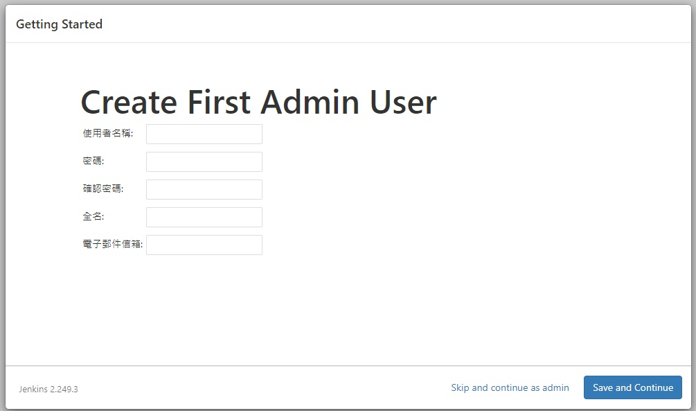
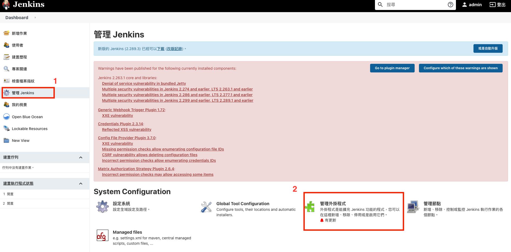
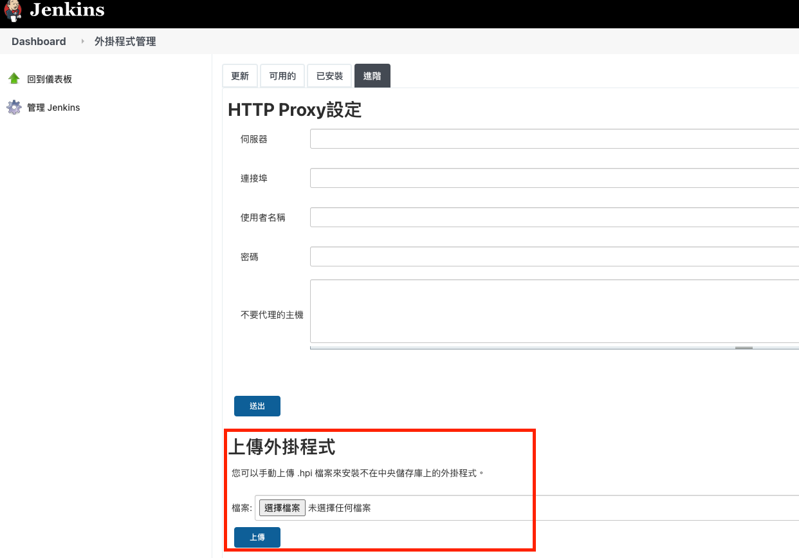
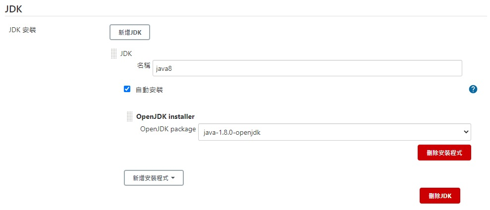
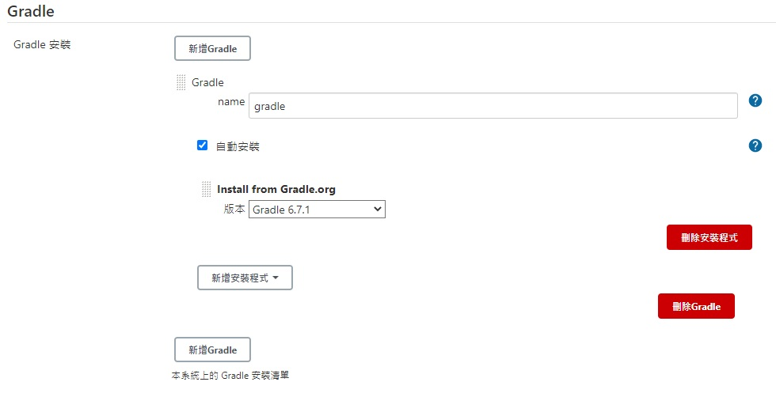
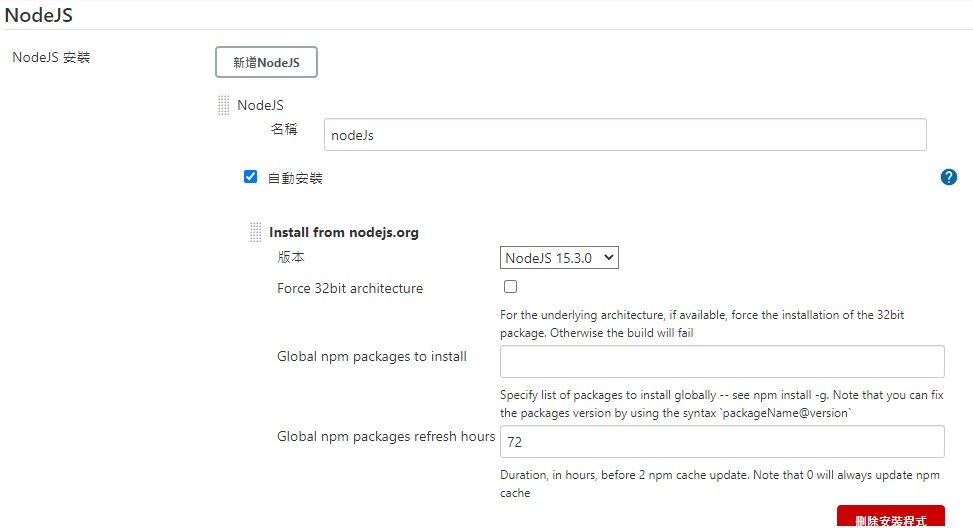

# 不連網安裝 docker Jenkins
＿＿＿＿＿＿＿＿＿＿＿＿＿＿＿＿＿＿＿＿＿＿＿＿＿＿＿＿＿＿＿＿＿＿＿＿

### Image :jenkinsci/blueocean

## 前置作業 - 準備 **docker映像檔** 跟 **jenkins套件**    

### docker image 映像檔

1. 須先從可以連網的機器將 jenkins image 抓下來

    ```console
    $ docker pull jenkinsci/blueocean 
    ```

2. 需將 docker image 檔案 export 出去, 才可裝到無法聯網的機器

    ```console
    $ docker save -o jenkins.tar jenkinsci/blueocean 
    ```

### jenkins 套件

1. 連進 jenkins 套件網址: [套件網站](https://updates.jenkins-ci.org/download/plugins/)
2. 找尋以下套件
    * openJDK-native-plugin
    * NodeJS
    * Publish Over SSH

## 安裝Jenkins
1. 從檔案回復Image
    
    ```console
    $ docker load jenkins.tar
    ```
2. 執行Docker Jenkins

    ```console
    $ docker run \ 
      -d \
      -u root \
      -p 8080:8080 \
      -p 50000:50000 \
      -v jenkins-data:/var/jenkins_home \
      -v /var/run/docker.sock:/var/run/docker.sock \
      -e JAVA_OPTS=-Duser.timezone=Asia/Taipei \
      --name jenkins \
      jenkinsci/blueocean
    ```
3. 執行完後可以看到 Jenkins 已啟動
4. 連至 localhost:8080 顯示需要輸入密碼解鎖
5. 進入 Docker container，查看密碼
    ```console
    $ docker exec -it jenkins bash 
    $ cat /var/jenkins_home/secrets/initialAdminPassword
    ```
6. Customize Jenkins
    * 選擇 Install suggested plugins

7. 設定帳號
    
8. 安裝Jenkins 外掛程式, 點選左邊側欄 管理 Jenkins --> 管理外掛程式

   
9. 點選進階 --> 選擇檔案 --> 按『上傳』, 上傳先前準備的 jenkins 套件

   
10. 設定 Global Tool Configuration
    1. 新增JDK

          
    2. 新增Gradle

          
    3. 新增NodeJs
    
          