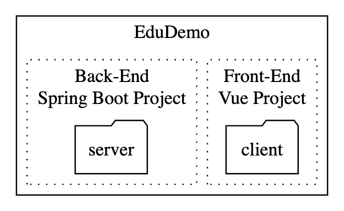

# 二. 建立後端專案 Spring Boot 以及 前端專案 Vue.js
###### tags: `latest`

> 範例使用 Windows 10 x64 平台，範例 EduDemo 專案建置在 D:/Projects 資料夾路徑底下
> 讀者可以更換置想要的路徑下建置專案，以下會以 ${your_path} 代稱 EduDemo 的上一層路徑

## 目標如下圖的專案結構




## 使用 IntelliJ 建立 EduDemo gradle 專案

1. 點選新增專案 Create New Project
    
    
1. 填寫專案的 ID 編號組，因為一般 Web 專案沒有像 library 般全球發佈，命名上就不需要太過要求
    * GroupId: com.aic.edudemo
    * ArtifactId: EduDemo
    * Version: 1.0-SNAPSHOT
    * [ID 補充介紹](https://maven.apache.org/guides/mini/guide-naming-conventions.html)
  

    :::info
    **Gradle 專案架構簡介**
    :::
    * build.gradle
        * 此 gradle 專案建置的設定檔，主要有函式庫的引入、引入時的設定以及任務的設置等
    * setting.gradle
        * 此 gradle 專案與其他 gradle 專案間的設定檔
    * gradle 資料夾, gradlew, gradlew.bat
        * 為了在專案中固定使用的 gradle 版本，gradle 採用的策略
        * 指令使用 gradle 時會呼叫作業系統安裝的 gradle 版本
        * 指令使用 gradlew 時會使用專案中的 gradle-wrapper.jar 版本
        * gradlew 以及 gradlew.bat 是在 Unix 系統和 Window 都能執行 gradlew 指令
    * .gradle 資料夾
        * 放了 gradle 專案建置時的數據紀錄，自動產生不用編輯
    :::
2. 建立完的 EduDemo 專案架構
    * .idea 放置的是 IntelliJ 相關的專案設定
    ```
    EduDemo
    |   build.gradle
    |   gradlew
    |   gradlew.bat
    |   settings.gradle
    |
    +---.gradle
    |
    +---.idea
    |
    \---gradle
        \---wrapper
                gradle-wrapper.jar
                gradle-wrapper.properties
    ```

## 使用 Spring initializr 建立 Spring Boot 專案

### 建立 Spring boot 專案
1. 建立子專案 server，先至 [Spring Initializr](https://start.spring.io)
2. 填選欄位來建立 Spring Boot 專案，分**專案基礎資料**以及**函式庫相依設定**
* 專案基礎資料
    | 欄位                                  | 值              |
    | ------------------------------------- | --------------- |
    | Project                               | Gradle Project  |
    | Laguage                               | Java            |
    | Spring Boot                           | 2.7           |
    | Project Metadata/Group                | com.aic.edudemo |
    | Project Metadata/Artifact             | server          |
    | Project Metadata/Options/Name         | server          |
    | Project Metadata/Options/Packaga Name | com.aic.edudemo |
    | Project Metadata/Options/Packaging    | War             |
    | Project Metadata/Options/Java         | 8               |
    

* 函式庫相依設定
    | 函式庫               | 參考連結                                                                                                  |
    | -------------------- | --------------------------------------------------------------------------------------------------------- |
    | Spring Boot Devtools | https://docs.spring.io/spring-boot/docs/current/reference/html/using-spring-boot.html#using-boot-devtools |
    | Lombok               | https://projectlombok.org/                                                                                |
    | Spring Web           | https://docs.spring.io/spring/docs/current/spring-framework-reference/web.html#mvc-controller             |
    | Spring Data JPA      | https://docs.spring.io/spring-data/jpa/docs/current/reference/html/#reference                             |
    


3. 建立完專案下載後解壓縮，將解壓縮的 server 資料夾放在 EduDemo，並使用 cmd 
    ```cmd
    $ cd ${your_path}/EduDemo/server
    $ gradle bootRun
    ```
    * Started ServerApplication in xx seconds 表示 server 正常啟動了
    
    
    

    :::info 
    **Spring boot 專案簡介**
    
    除了先前介紹有關 Gradle 專案的檔案外，多了以下的檔案以及資料夾
    * .gitignore
        * 設定那些不希望被 git 做版本控管的檔案及資料夾
        * 像是 IDE 的設定檔、編譯而產生的檔案等
    * HELP.md
        * Spring Boot 自動產生的 markdown 格式說明文件
    * **src 資料夾**
        * 在 src/main/java 下撰寫 java 檔案，之下的資料夾視為 java package
        * 在 src/main/resources 下放靜態資源以及設定檔
        * 在 src/test/java 下撰寫 java 測試碼
    :::
1. server 的資料夾目錄架構
    ```
    server
    |   .gitignore
    |   build.gradle
    |   gradlew
    |   gradlew.bat
    |   HELP.md
    |   settings.gradle
    |
    +---gradle
    |   \---wrapper
    |           gradle-wrapper.jar
    |           gradle-wrapper.properties
    |
    \---src
        +---main
        |   +---java
        |   |   \---com
        |   |       \---aic
        |   |           \---edudemo
        |   |                   ServerApplication.java
        |   |                   ServletInitializer.java
        |   |
        |   \---resources
        |       |   application.properties
        |       |
        |       +---static
        |       \---templates
        \---test
            \---java
                \---com
                    \---aic
                        \---edudemo
                                ServerApplicationTests.java
    ```
### Spring Boot 專案中預設內容
1. Spring Boot 專案的啟動點，寫在 ServerApplication.java 裡
    * @SpringBootApplication 集成了三種 annotation
        * @Configuration : 標示著該 class 歸類為 spring 設定檔
        * @ComponentScan : 掃描其他所需元件，將其註冊在 spring context 以供使用
        * @EnableAutoConfiguration : 開啟 spring 的自動設定配置
    ```java=
    @SpringBootApplication
    public class ServerApplication {

        public static void main(String[] args) {
            SpringApplication.run(ServerApplication.class, args);
        }

    }
    ```
2. 為了支援 WAR 格式佈署在 Servlet Container 的技術，ServletInitializer.java 的預設設定告知 Servlet Container 在啟動時，需要生成的 Spring Boot 相關物件
    ```java=
    public class ServletInitializer extends SpringBootServletInitializer {

        @Override
        protected SpringApplicationBuilder configure(SpringApplicationBuilder application) {
            return application.sources(ServerApplication.class);
        }

    }    
    ```
1. resources/application.properties 是 Spring Boot 相關的設定檔，除了 properties 的格式外，支援 yaml 格式

    ::: warning
    之後的範例中會使用 yaml 的格式，在此將檔案改為 application.yml
    :::

### 導入 Vue + Quasar plugin

1. 在 EduDemo 的目錄下，輸入以下指令新增 quasar plugin
    ```cmd
    $ npm init quasar
    ```

    

2. 選擇第一個
    
3. 這裡輸入client
    
4. 詢問使用的 Quasar 版本 ? 選擇 Quasar v2
    
5. 詢問專案使用的語言，選擇 Javascript
    
6. 詢問 Quasar cli 版本，使用vite
    
7. 詢問CSS 預處理器，選擇 Sass with SCSS syntax
    
8. 詢問 Quasar 其他配置，用空白鍵選 eslint, axios
    
9. 選擇es-lint格式, 這邊選擇Prettier
 
10. 選yes


12. 開始安裝
    
13. 安裝完成
    
14. 到目錄 client 下執行
    ```cmd
    $ cd ${your_path}/EduDemo/client
    $ quasar dev
    ```
    
    
15. 執行後顯示 server 使用的 port 資訊
    
16. 到該網址看看執行的結果
    
  


## 使用 Gradle 控管 client

1. 首先為了讓外部的 EduDemo 能夠控管，使用 Gradle 來初始化專案架構
1. 執行
    ```cmd
    $ cd ${your_path}/EduDemo/client
    $ gradle init
    ```
    
    
1. 選擇 1.basic
    
1. 選擇 1.Groovy
    
1. Project Name 用預設的 client
    
   

## 完成的專案結構

1. 接下來要使外層的 Gradle Project 關連到兩個子專案 Module
1. 在 EdeDemo/settings.gradle 加入兩個子專案名稱，將 settings.gradle 更改如下，並且點擊右邊的大象按鈕
    
1. 所以現在在 EduDemo 資料夾下也可以啟動 server 專案了
    ```cmd
    $ cd ${your_path}/EduDemo
    $ gradle bootRun
    ```
### 最後完成的 EduDemo 專案結構


```
EduDemo
|   .project
|   build.gradle
|   gradlew
|   gradlew.bat
|   settings.gradle
|
+---.gradle
|
+---.idea
|
+---client
|   |   .browserslistrc
|   |   .editorconfig
|   |   .eslintrc.js
|   |   .gitattributes
|   |   .gitignore
|   |   babel.config.js
|   |   build.gradle
|   |   gradlew
|   |   gradlew.bat
|   |   package-lock.json
|   |   package.json
|   |   README.md
|   |   settings.gradle
|   |   vue.config.js
|   |
|   +---.gradle
|   |
|   +---gradle
|   |   \---wrapper
|   |           gradle-wrapper.jar
|   |           gradle-wrapper.properties
|   |
|   +---node_modules
|   |
|   +---public
|   |       favicon.ico
|   |       index.html
|   |
|   \---src
|       |   App.vue
|       |   main.js
|       |   quasar.js
|       |
|       +---assets
|       |       logo.png
|       |
|       +---components
|       |       HelloWorld.vue
|       |
|       +---router
|       |       index.js
|       |
|       +---store
|       |       index.js
|       |
|       +---styles
|       |       quasar.scss
|       |       quasar.variables.scss
|       |
|       \---views
|               About.vue
|               Home.vue
|
+---gradle
|   \---wrapper
|           gradle-wrapper.jar
|           gradle-wrapper.properties
|
\---server
    |   .gitignore
    |   build.gradle
    |   gradlew
    |   gradlew.bat
    |   HELP.md
    |   settings.gradle
    |
    +---gradle
    |   \---wrapper
    |           gradle-wrapper.jar
    |           gradle-wrapper.properties
    |
    \---src
        +---main
        |   +---java
        |   |   \---com
        |   |       \---aic
        |   |           \---edudemo
        |   |                   ServerApplication.java
        |   |                   ServletInitializer.java
        |   |
        |   \---resources
        |       |   application.yml
        |       |
        |       +---static
        |       \---templates
        \---test
            \---java
                \---com
                    \---aic
                        \---edudemo
                                ServerApplicationTests.java
```
